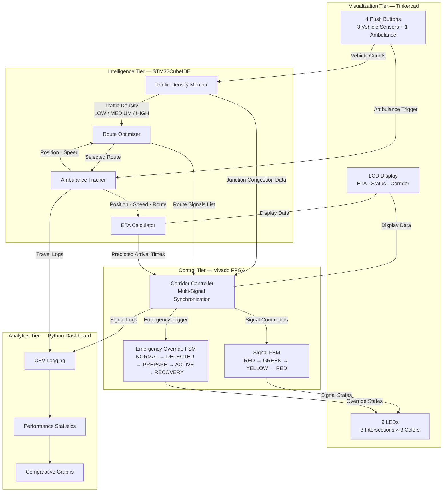
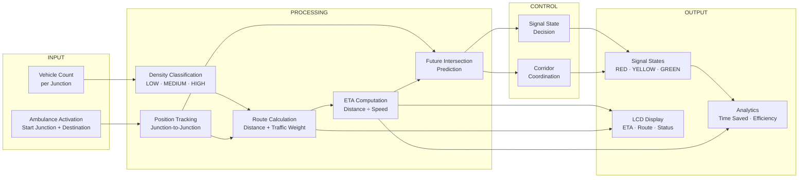
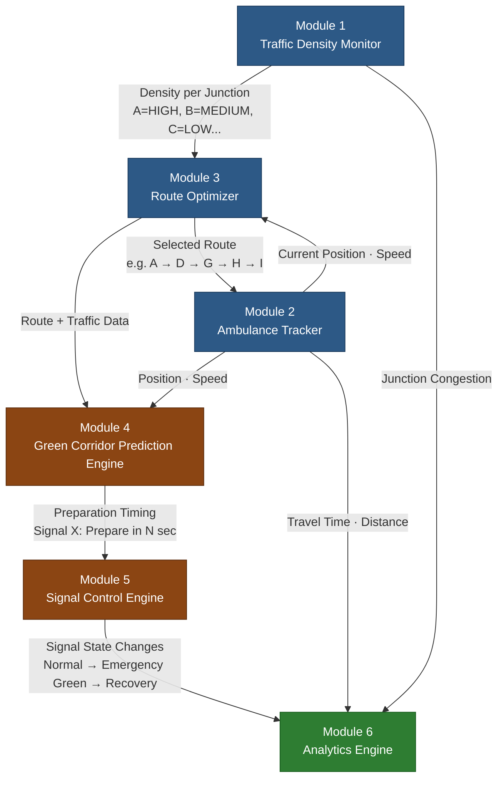
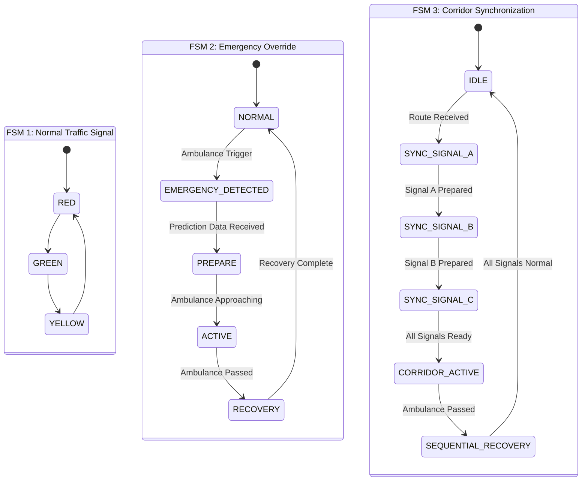
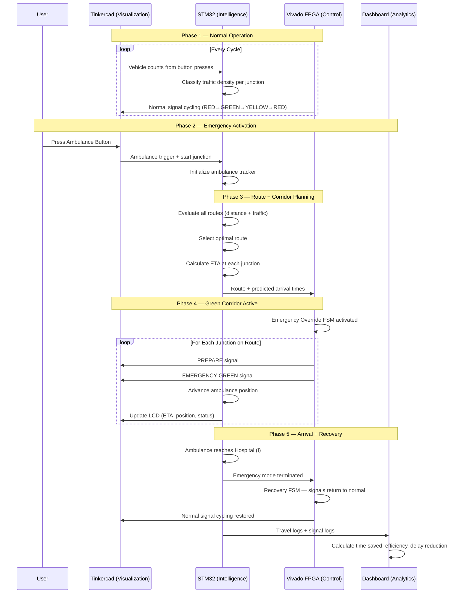

# System Architecture

**Predictive Ambulance Green Corridor Generator using Traffic-Aware Signal Coordination**

---

## Table of Contents

1. [System Architecture Overview](#1-system-architecture-overview)
2. [Complete Data Flow](#2-complete-data-flow)
3. [Module Interaction Diagram](#3-module-interaction-diagram)
4. [Traffic Simulation Layer](#4-traffic-simulation-layer)
5. [STM32 Traffic Intelligence Layer](#5-stm32-traffic-intelligence-layer)
6. [Ambulance Tracking Layer](#6-ambulance-tracking-layer)
7. [Route Optimization Layer](#7-route-optimization-layer)
8. [ETA Prediction Layer](#8-eta-prediction-layer)
9. [FPGA Green Corridor Engine](#9-fpga-green-corridor-engine)
10. [Signal Control Layer](#10-signal-control-layer)
11. [Analytics Layer](#11-analytics-layer)
12. [End-to-End Execution Flow](#12-end-to-end-execution-flow)
13. [Design Decisions](#13-design-decisions)
14. [Scalability Considerations](#14-scalability-considerations)
15. [Hardware Migration Possibilities](#15-hardware-migration-possibilities)

---

## 1. System Architecture Overview

The system is organized into three distinct processing tiers, each implemented using a dedicated ECE tool. Together, they form a layered architecture where **intelligence**, **control**, and **visualization** are cleanly separated.

| Tier | Tool | Role |
|---|---|---|
| **Intelligence Tier** | STM32CubeIDE | Traffic monitoring, ambulance tracking, route optimization, ETA calculation |
| **Control Tier** | Vivado (Verilog) | Traffic signal FSMs, emergency override logic, corridor synchronization |
| **Visualization Tier** | Tinkercad (Arduino UNO) | LED-based signal simulation, button-based sensor input, LCD status output |
| **Analytics Tier** | Python (Optional) | Performance measurement, CSV logging, comparative analysis |

### System Architecture Diagram



---

## 2. Complete Data Flow

Data flows through the system in a well-defined pipeline — from raw sensor input to coordinated signal output and performance measurement.

### Data Flow Diagram



### Data Flow Summary

| Stage | Input | Processing | Output |
|---|---|---|---|
| **Sensing** | Vehicle counts at 9 junctions | — | Raw count per junction |
| **Classification** | Raw vehicle count | Threshold comparison (0–10 / 11–25 / 26+) | LOW, MEDIUM, or HIGH |
| **Tracking** | Ambulance start command | Position update each cycle | Current junction, speed, distance remaining |
| **Routing** | Traffic density + road distances | Weighted path evaluation | Selected route (sequence of junctions) |
| **Prediction** | Position + speed + route | Time-to-arrival at each future junction | Predicted arrival time per signal |
| **Corridor** | Predicted arrival times | Signal preparation scheduling | Signal commands (PREPARE → GREEN) |
| **Signal Control** | Signal commands | FSM state transitions | Physical signal states |
| **Analytics** | Travel logs + signal logs | Statistical comparison | Time saved, efficiency %, signals cleared |

---

## 3. Module Interaction Diagram

The six functional modules communicate through clearly defined data interfaces. No module directly controls another — they exchange data, and each module acts on the data it receives.

### Component Interaction Diagram



> **Blue** = STM32 Intelligence Layer · **Brown** = FPGA Control Layer · **Green** = Analytics Layer

---

## 4. Traffic Simulation Layer

The traffic simulation layer generates the dynamic environment in which the system operates. It produces realistic, varying traffic conditions across the 9-junction city network.

### City Network Topology

```
A --- B --- C
|         |         |
D --- E --- F
|         |         |
G --- H --- I

Hospital = Junction I
```

All roads are bidirectional. Each junction connects to its immediate horizontal and vertical neighbors.

### Traffic Density Classification

Vehicle counts at each junction are classified into three levels:

| Level | Vehicle Count | Meaning |
|---|---|---|
| **LOW** | 0 – 10 | Free-flowing traffic, minimal delay |
| **MEDIUM** | 11 – 25 | Moderate congestion, some delay expected |
| **HIGH** | 26+ | Heavy congestion, significant delay |

### Simulation Method

- In **Tinkercad**, push buttons simulate vehicle arrivals — each press represents one vehicle arriving at a junction.
- In **STM32CubeIDE**, vehicle counts are generated programmatically to simulate changing traffic patterns across all 9 junctions.

---

## 5. STM32 Traffic Intelligence Layer

STM32CubeIDE serves as the **central traffic management computer** — the brain of the entire system. It runs four tightly integrated modules.

### Module Responsibilities

| Module | File | Function |
|---|---|---|
| Traffic Density Monitor | `traffic_monitor.c` | Collects vehicle counts, classifies density at each junction |
| Ambulance Tracker | `ambulance_tracker.c` | Tracks position, speed, distance remaining; updates every cycle |
| Route Optimizer | `route_optimizer.c` | Evaluates routes using distance + traffic weight; selects optimal path |
| ETA Calculator | `eta_calculator.c` | Computes estimated time of arrival based on distance and speed |

### STM32 Output

The STM32 layer produces a consolidated output containing:

- Traffic status at all 9 junctions
- Selected route to Hospital (I)
- Current ambulance position
- Estimated time of arrival

This data feeds into the FPGA control layer for signal coordination.

---

## 6. Ambulance Tracking Layer

The Ambulance Tracking Module maintains a continuous picture of the ambulance's state as it moves through the network.

### Tracked Variables

| Variable | Description | Example |
|---|---|---|
| `current_position` | The junction the ambulance is currently at or approaching | Junction D |
| `destination` | The target hospital | Junction I |
| `speed` | Current travel speed | Simulated value |
| `distance_remaining` | Distance left to destination along the selected route | 3 junctions |

### Movement Model

The ambulance moves **junction-to-junction** along the selected route. Each cycle:

1. Position advances to the next junction on the route.
2. Distance remaining decreases.
3. Updated position and speed are sent to the Route Optimizer and ETA Calculator.

The movement uses **virtual coordinates** — no GPS or physical positioning is involved.

---

## 7. Route Optimization Layer

The Route Optimizer selects the fastest path from the ambulance's current position to Hospital (I) by weighing two factors.

### Decision Factors

| Factor | Weight | Source |
|---|---|---|
| **Road Distance** | Physical distance between junctions | City network topology |
| **Traffic Density** | Congestion level at each junction on the route | Traffic Density Monitor |

### Route Selection Logic

Given the ambulance at Junction A, possible routes to Hospital (I) include:

| Route | Path | Consideration |
|---|---|---|
| Route 1 | A → B → C → F → I | Shorter distance, but B and C may be congested |
| Route 2 | A → D → G → H → I | Longer distance, but junctions may have LOW traffic |
| Route 3 | A → D → E → F → I | Moderate distance and traffic |

The optimizer selects the route with the lowest combined cost (distance + congestion penalty).

> This creates **intelligence** instead of simple automation — the system doesn't just clear signals, it chooses the best path to clear.

---

## 8. ETA Prediction Layer

The ETA Calculator estimates when the ambulance will arrive at the hospital and — critically — when it will arrive at each **intermediate junction** along the route.

### ETA Computation

```
ETA at Hospital = Distance Remaining ÷ Current Speed
```

### Per-Junction Prediction

For the Green Corridor Prediction Engine, the ETA layer also computes arrival times at each upcoming junction:

| Junction on Route | Distance from Current Position | Predicted Arrival |
|---|---|---|
| Next junction | 1 segment | ~20 seconds |
| Junction after next | 2 segments | ~45 seconds |
| Following junction | 3 segments | ~70 seconds |

These per-junction predictions are the foundation of the **predictive green corridor** — they tell the FPGA exactly when to prepare each signal.

---

## 9. FPGA Green Corridor Engine

The Green Corridor Prediction Engine is the system's **core innovation**. It receives ambulance position, speed, and route data, then determines which signals need to change and when.

### Prediction Process

1. Receive current ambulance position and speed.
2. Receive the selected route (sequence of junctions).
3. For each upcoming junction on the route, calculate time-to-arrival.
4. Issue preparation commands to the Signal Control Engine.

### Preparation Timeline

| Time Before Arrival | Action |
|---|---|
| ~45 seconds | Signal receives **PREPARE** command — begins transitioning cross-traffic |
| ~20 seconds | Signal enters **EMERGENCY GREEN** — ambulance corridor direction is green |
| 0 seconds | Ambulance passes through |
| After passage | Signal enters **RECOVERY** — returns to normal cycling |

### FPGA FSM Architecture

The Vivado implementation contains three interconnected FSMs:



**FSM 1** handles normal traffic cycling at each junction.

**FSM 2** manages the emergency override lifecycle — from detection through preparation, active corridor, and recovery.

**FSM 3** ensures signals along the route open **in the correct sequential order** — Signal A opens first, then Signal B, then Signal C — matching the ambulance's direction of travel.

---

## 10. Signal Control Layer

The Signal Control Layer is the final decision point before signals physically change state. It arbitrates between normal operation and emergency override.

### Signal States

| Mode | Signal A | Signal B | Signal C |
|---|---|---|---|
| **Normal** | RED | GREEN | RED |
| **Emergency Corridor** | GREEN | GREEN | PREPARE GREEN |
| **Recovery** | Returns to cycle | Returns to cycle | Returns to cycle |

### State Priority

Emergency override **always** takes priority over normal signal cycling. When an emergency is active:

1. The normal FSM is suspended for affected signals.
2. The Emergency Override FSM takes control.
3. The Corridor Controller coordinates the sequence.
4. After the ambulance passes, signals recover to their pre-emergency cycle position.

### Vivado RTL Files

| File | Purpose |
|---|---|
| `signal_fsm.v` | Normal traffic signal FSM (RED → GREEN → YELLOW → RED) |
| `emergency_fsm.v` | Emergency override FSM (NORMAL → DETECTED → PREPARE → ACTIVE → RECOVERY) |
| `corridor_controller.v` | Multi-signal coordination and sequential green corridor |
| `green_corridor_top.v` | Top-level module connecting all three FSMs |
| `tb_green_corridor.v` | Testbench for simulation and waveform verification |

---

## 11. Analytics Layer

The Analytics Layer measures system effectiveness by comparing ambulance travel performance with and without the green corridor.

### Metrics

| Metric | Description | Example |
|---|---|---|
| **Travel Time Saved** | Difference between normal and corridor-assisted travel time | 6 minutes |
| **Average Delay Reduction** | Mean reduction in delay across all signals on the route | — |
| **Corridor Efficiency** | Percentage of signals successfully prepared before ambulance arrival | 92% |
| **Signals Cleared** | Number of signals that were set to green before the ambulance arrived | 4 of 5 |

### Analytics Output

| Parameter | Normal Mode | Corridor Mode |
|---|---|---|
| Travel Time | 14 – 15 min | 8 – 9 min |
| Signal Delays | Multiple red-light stops | Zero red-light stops |
| Route | Fixed / default | Optimized for traffic |

### Technology

- **Python** with **Matplotlib** for visualization.
- **CSV logs** from STM32 and signal control layers feed into the analytics engine.

---

## 12. End-to-End Execution Flow

The complete system execution follows this sequence from start to finish:



### Phase Summary

| Phase | Description |
|---|---|
| **Phase 1: Normal Operation** | All junctions cycle normally. Traffic density is monitored. |
| **Phase 2: Emergency Activation** | Ambulance is triggered. Tracking begins. |
| **Phase 3: Route + Corridor Planning** | Optimal route selected. ETA computed for each junction. |
| **Phase 4: Green Corridor Active** | Signals prepare and open ahead of the ambulance, junction by junction. |
| **Phase 5: Arrival + Recovery** | Ambulance reaches hospital. Signals recover. Analytics generated. |

---

## 13. Design Decisions

Key architectural decisions made during system design, along with their rationale:

| Decision | Choice | Rationale |
|---|---|---|
| **Intelligence on STM32** | All traffic logic, tracking, routing, and ETA run on STM32 | STM32 represents a realistic central traffic management computer. Firmware logic is flexible and easy to iterate. |
| **Signal control on FPGA** | All signal FSMs implemented in Verilog via Vivado | Traffic signal control is naturally a digital logic problem. FSM-based design demonstrates RTL and DLD skills — a core ECE competency. |
| **Visualization on Tinkercad** | LEDs, buttons, LCD on Arduino UNO | Provides an immediately understandable visual demonstration. No specialized hardware required. |
| **9-junction grid** | 3×3 city network | Enough complexity for meaningful route optimization while remaining easy to simulate and demonstrate. |
| **Single hospital at Junction I** | Fixed destination | Simplifies routing to a single-destination shortest path problem while still requiring traffic-aware decisions. |
| **Single ambulance** | One active emergency at a time | Avoids priority arbitration complexity in the first version while delivering the full corridor generation workflow. |
| **Fully simulated** | No physical hardware in initial development | Zero hardware cost. Faster iteration. Allows focus on logic and architecture before hardware deployment. |
| **Modular architecture** | 6 independent modules with defined interfaces | Each module can be developed, tested, and modified independently without affecting the rest of the system. |
| **Python for analytics** | Optional dashboard using Matplotlib + CSV | Lightweight, no infrastructure required. Produces professional graphs for project reports. |

---

## 14. Scalability Considerations

The modular architecture is designed to support future expansion without requiring a fundamental redesign.

### Network Scalability

| Current | Future |
|---|---|
| 9 junctions (3×3 grid) | Expandable to any N×N grid or irregular topology |
| 12 bidirectional roads | Additional roads added by extending the adjacency model |
| Single hospital (Junction I) | Multiple hospitals with nearest-hospital selection |

### Operational Scalability

| Current | Future |
|---|---|
| Single ambulance | Multiple concurrent ambulances with priority arbitration |
| Fixed route after selection | Adaptive route switching if traffic changes mid-transit |
| Simulated traffic patterns | Real-time traffic data integration |

### Module Scalability

Each module is independently replaceable:

- The **Route Optimizer** can be upgraded from simple weighted evaluation to Dijkstra's algorithm or A* pathfinding without changing other modules.
- The **Traffic Density Monitor** can switch from simulated button presses to real sensor input without changing the Ambulance Tracker or Route Optimizer.
- The **Signal Control Engine** FSM design scales naturally — adding a junction means adding another FSM instance with the same state machine.

---

## 15. Hardware Migration Possibilities

The system is designed for simulation-first development, with a clear path to physical hardware deployment.

### Migration Path

| Layer | Simulation Tool | Hardware Target |
|---|---|---|
| Intelligence | STM32CubeIDE simulation | Physical STM32 board (e.g., STM32F103C8 Blue Pill) |
| Signal Control | Vivado behavioral simulation | Physical FPGA board (e.g., Basys 3, Nexys A7) |
| Visualization | Tinkercad virtual circuit | Physical breadboard with LEDs, buttons, and LCD |
| Sensing | Button presses / programmatic values | IR sensors, ultrasonic sensors, or inductive loops |

### What Stays the Same

- All STM32 firmware code (`.c` files) runs on physical STM32 hardware without modification.
- All Verilog RTL code (`.v` files) synthesizes directly onto FPGA hardware.
- Module interfaces and data flow remain identical.

### What Changes

- **Communication** between STM32 and FPGA would require a physical interface (UART, SPI, or GPIO).
- **Tinkercad Arduino code** would need to be transferred to a physical Arduino or replaced by direct FPGA-driven signal outputs.
- **Traffic sensors** would replace simulated button presses with real vehicle detection hardware.

> The architecture is intentionally designed so that **logic is developed and validated in simulation first**, then **deployed to hardware with minimal code changes**.

---

> **Architecture version:** Consistent with [System Architecture Document](docs/SYSTEM_ARCHITECTURE.md) · Single ambulance · Single hospital · 9-junction network · Fully simulated environment
