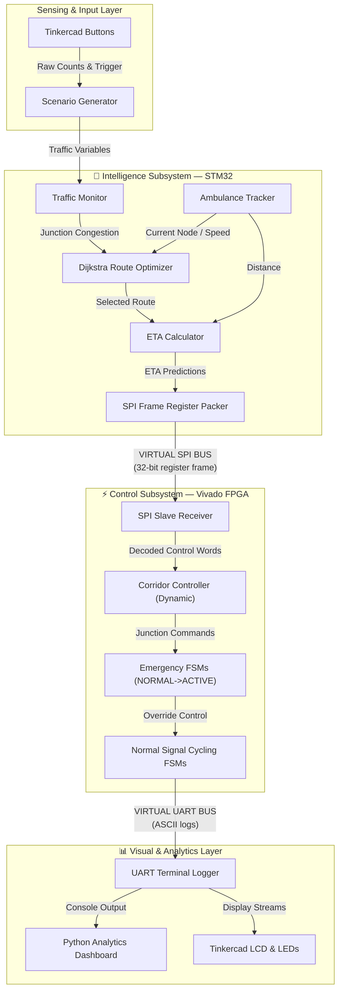

# System Architecture — Embedded Digital Twin Model

**Predictive Ambulance Green Corridor Generator using Traffic-Aware Signal Coordination**

---

## 1. System Architecture Overview

This project is architected as a **Simulation-First Embedded Digital Twin**. Rather than running isolated simulation routines, each tool represents an independent embedded subsystem. Communication between these subsystems is executed using **Virtual SPI** and **Virtual UART** interfaces that exactly model their physical hardware register and signal counterparts.

| Subsystem | Environment | Physical Equivalent | Role in Digital Twin |
|---|---|---|---|
| **Traffic Intelligence** | STM32CubeIDE | STM32F103 MCU Board | Tracks ambulance, runs Dijkstra route optimization, computes ETAs, generates virtual SPI frames. |
| **Control Controller** | Vivado (HDL) | Artix-7 FPGA Board | Decodes SPI inputs, runs safety-critical Signal & Emergency FSMs, writes UART signal logs. |
| **Visual Demonstration** | Tinkercad (Arduino) | Physical breadboard with LEDs/LCD | Demoted to output driver. Displays signal states on LEDs, route details on LCD. Outputs vehicle count pulses. |
| **Analytics Dashboard** | Python / CSV | Host PC UART Logger | Parses FPGA UART signal logs, outputs console reports, and generates comparison graphs. |

### Digital Twin Interconnection Diagram


---

## 2. Complete Data Flow Pipeline

The system establishes a closed-loop data pipeline from sensing to control and visualization:
1.  **Vehicle Input Stream:** Virtual traffic counters update vehicle count values for the 9 junctions.
2.  **Embedded Processing (STM32):** Counts are classified into LOW (0-10), MEDIUM (11-25), and HIGH (26+) densities. The dynamic pathfinder selects the route. The ETA Calculator schedules predicted arrival intervals.
3.  **Virtual SPI Master Output:** The STM32 compiles the 32-bit control frame, generates the error-detecting XOR checksum, and writes it to the Virtual SPI channel.
4.  **Hardware FSM Arbitration (FPGA):** The FPGA reads the packet, verifies the checksum, and maps it to parallel registers. The `Corridor Controller` decodes the current ambulance position and the target corridor node, overriding normal cycles into `EMERGENCY_GREEN`.
5.  **Virtual UART Bus:** The FPGA outputs signal state lines to the Virtual UART log.
6.  **Visualization & Playback:** Tinkercad parses this log to animate the smart city LEDs and LCD, while Python compiles performance charts.

---

## 3. Subsystem Communication Protocols

### A. Virtual SPI Protocol (32-Bit Register Frame)
The STM32 (SPI Master) transmits control packets to the FPGA (SPI Slave) every 200ms using the following register map:

```
 31  30      27 26      23 22                  11 10   8 7          0
┌───┬──────────┬──────────┬──────────────────────┬──────┬────────────┐
│ E │ AMB_NODE │ TGT_NODE │      ETA_SECONDS     │ DIST │  CHECKSUM  │
└───┴──────────┴──────────┴──────────────────────┴──────┴────────────┘
```
*   **Bit 31 (EMG_ACTIVE):** Asserted (1) during emergency runs, otherwise 0.
*   **Bits 30-27 (AMB_NODE):** Current ambulance position node (0000=A, ..., 1000=I).
*   **Bits 26-23 (TGT_NODE):** Next intersection that must prepare preemption (0–8).
*   **Bits 22-11 (ETA_SECONDS):** ETA to `TGT_NODE` (0–4095 seconds).
*   **Bits 10-8 (DIST_REMAIN):** Node distance remaining to the hospital (0–7).
*   **Bits 7-0 (CHECKSUM):** XOR checksum of the first 24 bits for error validation.

### B. Virtual UART Protocol (ASCII Serial Frame)
The FPGA serial transmitter coordinates with the Arduino receiver using a 9600 Baud equivalent serial stream:
Format: `$` `A` `B` `C` `E` `e` `t` `t` `\n` (e.g., `$2201A24\n`)
*   `$`: Frame start byte.
*   `A`, `B`, `C`: Active signal states for Junctions A, B, C (0=RED, 1=YELLOW, 2=GREEN, 3=EMG_GREEN).
*   `E`: Central system mode (0=Normal, 1=Route display, 2=Corridor, 3=Arrival, 4=Recovery).
*   `e`: Ambulance position character (`A` to `I` or `-`).
*   `tt`: Cumulative remaining ETA minutes (00 to 99).
*   `\n`: Frame end delimiter.

---

## 4. Subsystem Module Mappings

### A. STM32 Intelligence Tier
*   **Traffic Density Monitor (`traffic_monitor.c`):** Collects raw vehicle volumes, classifying them into low/medium/high states.
*   **Ambulance Tracker (`ambulance_tracker.c`):** Manages position coordinates, velocity vectors, and active tracking states.
*   **Route Optimizer (`route_optimizer.c`):** Dijkstra's routing optimizer. Minimizes path cost using distance and traffic weight penalties.
*   **ETA Calculator (`eta_calculator.c`):** Dynamically computes travel times and intermediate junction crossing predictions.

### B. Vivado FPGA Control Tier
*   **SPI Slave Receiver (`spi_slave_receiver.v`):** Deserializes serial MOSI bits, runs clock synchronizers, and verifies XOR checksums.
*   **Corridor Controller (`corridor_controller.v`):** Evaluates `AMB_NODE` and `TGT_NODE` registers dynamically to schedule prep, active, and recovery override pulses.
*   **Junction Emergency FSM (`emergency_fsm.v`):** Handles preemption lifecycle: `NORMAL ➔ DETECTED ➔ PREPARE ➔ ACTIVE ➔ RECOVERY`.
*   **Junction Signal FSM (`signal_fsm.v`):** Cycles normal traffic signals autonomously unless overridden by `override_green` or paused by `suspend`.

### C. Arduino Tinkercad Visualization Tier
*   **I/O Extender & Display Driver (`smart_city_traffic_controller.ino`):** Reads the Virtual UART ASCII frame. Directly drives pins `D2-D10` (signal LEDs) and prints characters to the `LiquidCrystal` LCD based on the parsed data. No local route calculations or state machines are executed.

---

## 5. Project Folder Redesign

The codebase is organized into standardized embedded directories:

```
Predictive-Ambulance-Green-Corridor-Generator/
├── docs/                             # Core Project Documentation
├── shared/
│   └── protocols/                    # SPI & UART register definitions and schemas
├── stm32/                            # STM32 C Firmware
│   ├── include/                      # Headers with SPI frame structs
│   └── tests/                        # Simulation test harnesses
├── vivado/                           # Verilog HDL Subsystem
│   ├── rtl/                          # Syntehesizable RTL modules (SPI, FSMs)
│   └── testbench/                    # Behavioral validation testbenches
├── tinkercad/                        # Arduino display driver code
├── simulation/
│   ├── scenarios/                    # Scenario input traffic counts (JSON/CSV)
│   ├── virtual_bus/                  # spi_bus.txt and uart_bus.txt files
│   └── orchestrator/                 # Scripts feeding files between simulations
└── results/                          # Output logs and analytics graphs
```

---

## 6. Hardware Migration Path

The digital twin simulation is designed to map directly onto silicon:
*   **STM32:** The virtual register packing code translates directly to physical SPI registers by replacing the file logger function with `HAL_SPI_Transmit()`.
*   **FPGA:** The simulated `spi_slave_receiver` core synthesizes directly to hardware gates. Port pins are assigned to physical SPI PMOD connectors in the `.xdc` constraint file.
*   **Arduino:** The Tinkercad sketch compiles without changes in the Arduino IDE. Arduino's RX hardware pin (`D0`) is connected to the FPGA's physical UART TX PMOD pin.

*Refer to [MIGRATION_PLAN.md](file:///d:/Projects/Personal/Predictive-Ambulance-Green-Corridor-Generator/MIGRATION_PLAN.md) for pinouts, register mappings, and clock domain crossing designs.*
