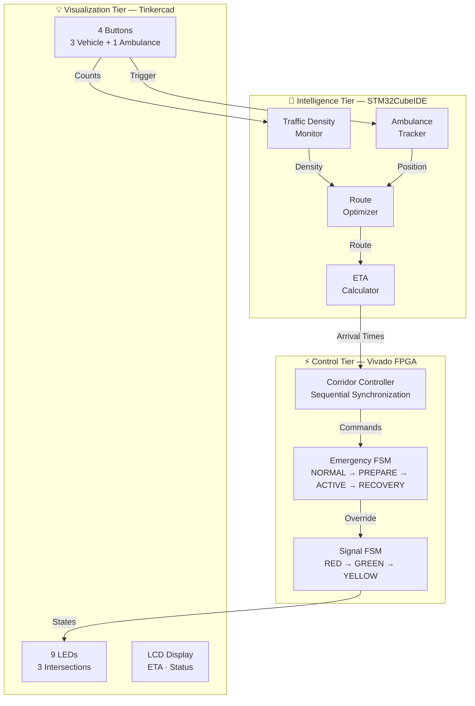
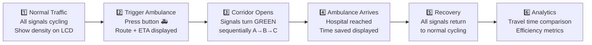

<h1 align="center">🚑 Predictive Ambulance Green Corridor Generator</h1>

<p align="center">
  <strong>Traffic-Aware Signal Coordination for Emergency Response</strong>
</p>

<p align="center">
  
  
  
  
</p>

<p align="center">
  
  
  
  
  
</p>

---

## 📋 Project Description

The **Predictive Ambulance Green Corridor Generator** is an ECE mini-project that designs and simulates an intelligent traffic management system capable of creating a **predictive green corridor** for ambulances.

Unlike conventional emergency traffic systems that react *after* an ambulance reaches an intersection, this system **predicts the ambulance's future path** and **proactively coordinates traffic signals ahead of time** — clearing the route before the ambulance arrives.

```
  🏥 Conventional System              🚀 This Project
  ─────────────────────              ────────────────────
  Ambulance arrives                  System predicts path
         ↓                                  ↓
  Signal changes                     Signals change early
         ↓                                  ↓
  Ambulance waits                    Ambulance passes through
         ↓                                  ↓
  Time wasted ❌                     Time saved ✅
```

The project operates entirely within a **simulated environment** using three industry-standard ECE tools — **STM32CubeIDE**, **Vivado**, and **Tinkercad** — with an optional **Python analytics dashboard**.

---

## 🔍 Problem Statement

Emergency vehicles frequently experience critical delays due to traffic congestion and the limitations of conventional traffic signal systems.

| Problem | Impact |
|---|---|
| Signals operate on **fixed timing schedules** | No adaptation to emergency situations |
| Response occurs **only when the ambulance physically arrives** | Delays are unavoidable by design |
| **No coordination** among neighboring signals | Each intersection is an independent obstacle |
| **No route optimization** based on live traffic | Ambulances may travel through heavily congested corridors |

> Every second of delay during patient transport can directly impact patient outcomes. This project addresses the gap between **emergency urgency** and **traffic infrastructure intelligence**.

---

## 💡 Solution Overview

The system creates a **virtual city traffic network** consisting of a 3×3 grid of 9 junctions where:

```
A --- B --- C
|         |         |
D --- E --- F
|         |         |
G --- H --- I   ← Hospital
```

| Capability | Description |
|---|---|
| 🔄 **Dynamic Traffic Monitoring** | Vehicle counts classified as LOW / MEDIUM / HIGH at all 9 junctions |
| 📍 **Ambulance Tracking** | Continuous position, speed, and distance tracking |
| 🗺️ **Route Optimization** | Selects the fastest path based on distance + traffic density |
| 🔮 **Predictive Corridor** | Signals turn GREEN *before* the ambulance arrives — not after |
| ⏱️ **ETA Prediction** | Per-junction arrival time prediction drives corridor timing |
| 📊 **Performance Analytics** | Measures travel time saved, corridor efficiency, delay reduction |

---

## 🏗️ Architecture

The system is organized into three processing tiers, each implemented with a dedicated tool.



| Tier | Tool | Responsibility |
|---|---|---|
| **Intelligence** | STM32CubeIDE | Traffic monitoring, ambulance tracking, route optimization, ETA calculation |
| **Control** | Vivado (Verilog) | Traffic signal FSMs, emergency override, corridor synchronization |
| **Visualization** | Tinkercad (Arduino) | LED signals, button inputs, LCD status display |
| **Analytics** | Python (Optional) | Performance measurement, CSV logging, comparison graphs |

---

## 🛠️ Technology Stack

| Layer | Technology | Language | Purpose |
|---|---|---|---|
| **Embedded Intelligence** | STM32CubeIDE | C | Traffic monitoring, tracking, routing, ETA |
| **Digital Logic** | Vivado | Verilog | Signal FSMs, emergency override, corridor control |
| **Circuit Simulation** | Tinkercad | Arduino (C++) | Visual demonstration with LEDs, buttons, LCD |
| **Analytics Dashboard** | Python | Python | Performance visualization with Matplotlib + CSV |
| **Documentation** | Markdown | — | GitHub-ready professional documentation |
| **Version Control** | Git + GitHub | — | Repository management |

### Key Specifications

| Parameter | Value |
|---|---|
| MCU Target | STM32F103C8 (or equivalent) |
| FPGA Simulation | Vivado Behavioral Simulation |
| HDL Language | Verilog |
| City Network | 3×3 Grid — 9 Junctions, 12 Bidirectional Roads |
| Hospital | Junction I (fixed) |
| Scope | Single ambulance, single hospital |
| Environment | Fully simulated — zero hardware cost |

---

## 📁 Repository Structure

```
Predictive-Ambulance-Green-Corridor-Generator/
│
├── README.md                          ← You are here
├── ARCHITECTURE.md                    ← Full system architecture with Mermaid diagrams
├── STM32_DESIGN.md                    ← STM32 subsystem design document
├── VIVADO_DESIGN.md                   ← FPGA subsystem design document
├── TINKERCAD_DESIGN.md                ← Tinkercad simulation design document
├── LICENSE
├── .gitignore
│
├── docs/                              ← Core project documentation
│   ├── PROJECT_OVERVIEW.md            ← High-level project introduction
│   ├── SRS.md                         ← Software Requirements Specification
│   ├── SYSTEM_ARCHITECTURE.md         ← System Architecture Document
│   ├── IMPLEMENTATION_GUIDE.md        ← Step-by-step build instructions
│   ├── ROADMAP.md                     ← 6-week development roadmap
│   ├── screenshots/                   ← Documentation screenshots
│   ├── diagrams/                      ← Architecture diagrams
│   └── reports/                       ← Final reports
│
├── stm32/                             ← STM32CubeIDE firmware
│   ├── TrafficMonitor/                ← Traffic density monitoring module
│   ├── AmbulanceTracker/              ← Ambulance position tracking module
│   ├── RouteOptimizer/                ← Route selection module
│   ├── ETACalculator/                 ← Arrival time estimation module
│   ├── include/                       ← Shared headers
│   └── tests/                         ← Unit tests
│
├── vivado/                            ← Vivado FPGA design
│   ├── rtl/                           ← RTL source files
│   │   ├── signal_fsm.v               ← Normal traffic signal FSM
│   │   ├── emergency_fsm.v            ← Emergency override FSM
│   │   ├── corridor_controller.v      ← Multi-signal corridor coordinator
│   │   └── green_corridor_top.v       ← Top-level integration module
│   ├── testbench/
│   │   └── tb_green_corridor.v        ← Simulation testbench
│   ├── waveforms/                     ← Simulation waveform captures
│   └── constraints/                   ← Constraint files
│
├── tinkercad/                         ← Tinkercad simulation
│   ├── circuit_design/                ← Circuit design files
│   ├── arduino_code/                  ← Arduino sketch
│   └── screenshots/                   ← Simulation screenshots
│
├── simulation/                        ← Simulation data
│   ├── city_map/                      ← City network definition
│   ├── traffic_data/                  ← Traffic scenario data
│   ├── route_data/                    ← Route calculation data
│   └── ambulance_scenarios/           ← Test scenario definitions
│
├── dashboard/                         ← Analytics dashboard
│   ├── analytics.py                   ← Dashboard application
│   ├── data/                          ← Input CSV data
│   ├── graphs/                        ← Generated graphs
│   └── exports/                       ← Exported reports
│
└── results/                           ← Final project results
    ├── screenshots/                   ← All captured screenshots
    ├── graphs/                        ← Performance comparison graphs
    ├── waveforms/                     ← FPGA waveform captures
    └── reports/                       ← Final project reports
```

---

## 🗓️ Development Roadmap

| Week | Focus | Key Deliverable | Status |
|---|---|---|---|
| **Week 1** | 📐 Project Foundation | Complete design documentation, city network finalized, tools installed | ✅ |
| **Week 2** | 🧠 STM32 Intelligence | Console output: traffic status, selected route, ETA, ambulance position | ✅ |
| **Week 3** | ⚡ Vivado Signal Control | Waveforms: normal operation, emergency override, corridor generation | ✅ |
| **Week 4** | 💡 Tinkercad Simulation | Working visual demo: LEDs change on ambulance button press | ✅ |
| **Week 5** | 📊 Integration & Analytics | Dashboard: time saved, efficiency, comparison graphs | ☐ |
| **Week 6** | ✨ Final Polish | Screenshots, report, presentation, complete demo | ☐ |

### Milestones

| Milestone | Gate Criteria |
|---|---|
| **M1 — Design Complete** | All docs written, network finalized, tools verified |
| **M2 — Intelligence Working** | STM32 produces correct traffic + routing output |
| **M3 — Signals Verified** | Vivado waveforms prove all FSM transitions |
| **M4 — Visual Demo Ready** | Tinkercad circuit responds to ambulance trigger |
| **M5 — Analytics Complete** | Dashboard shows measurable time savings |
| **M6 — Project Deliverable** | Presentation-ready with all evidence |

---

## ⭐ Major Features

### 🔮 Predictive Corridor — The Core Innovation

> **Conventional:** Ambulance arrives → Signal changes
>
> **This project:** Signal changes → *Then* ambulance arrives

The system predicts which intersections the ambulance will reach next and prepares those signals **before arrival** — transforming signal control from reactive to predictive.

### 🗺️ Traffic-Aware Route Optimization

Routes are selected based on **distance + traffic density**, not just shortest path. If Junction B is congested, the system routes through Junction D instead.

### ⚡ FPGA-Based Signal Control

Three FSMs implemented in Verilog:

| FSM | States | Function |
|---|---|---|
| **Signal FSM** | RED → GREEN → YELLOW → RED | Normal traffic cycling |
| **Emergency FSM** | NORMAL → DETECTED → PREPARE → ACTIVE → RECOVERY | Emergency override lifecycle |
| **Corridor Controller** | IDLE → SYNC → ACTIVE → RECOVERY | Sequential multi-signal coordination |

### 📊 Performance Analytics

| Metric | Description |
|---|---|
| Travel Time Saved | Normal time − Corridor time |
| Corridor Efficiency | Signals cleared ÷ Total signals × 100% |
| Delay Reduction | Time saved ÷ Normal time × 100% |
| Signals Cleared | Count of signals green before ambulance arrival |

---

## 🎬 Demo Flow

A complete demonstration runs in **5–7 minutes**:



| Step | Duration | What You See |
|---|---|---|
| Normal Traffic | ~60 sec | LEDs cycling, LCD shows density |
| Ambulance Trigger | ~30 sec | LCD shows route + ETA |
| Corridor Active | ~2–3 min | LEDs turn GREEN sequentially ahead of ambulance |
| Arrival | ~30 sec | LCD: "AMB AT HOSPITAL" + time saved |
| Recovery | ~30 sec | All LEDs resume normal cycling |
| Analytics | ~60 sec | Dashboard shows performance metrics |

---

## 📈 Expected Results

| Parameter | Normal Mode | Corridor Mode | Improvement |
|---|---|---|---|
| **Travel Time** | 14 – 15 min | 8 – 9 min | **~6 min saved** |
| **Red-Light Stops** | Multiple | Zero | **100% reduction** |
| **Route Selection** | Default / fixed | Traffic-optimized | **Congestion avoided** |
| **Corridor Efficiency** | N/A | ~92% | **Signals cleared proactively** |
| **Signal Coordination** | None | Sequential predictive | **Fully automated** |

---

## 📚 Documentation

### Design Documents

| Document | Description |
|---|---|
| [Project Overview](docs/PROJECT_OVERVIEW.md) | High-level introduction for repository visitors |
| [System Architecture](ARCHITECTURE.md) | Full architecture with Mermaid diagrams and data flow |
| [STM32 Design](STM32_DESIGN.md) | Complete STM32 subsystem — modules, data structures, test cases |
| [Vivado Design](VIVADO_DESIGN.md) | Complete FPGA subsystem — FSMs, state tables, waveform expectations |
| [Tinkercad Design](TINKERCAD_DESIGN.md) | Complete simulation — circuit layout, pin mapping, demo script |

### Specification Documents

| Document | Description |
|---|---|
| [Software Requirements Specification](docs/SRS.md) | 10 functional requirements, 7 NFRs, 6 use cases, constraints |
| [System Architecture Document](docs/SYSTEM_ARCHITECTURE.md) | Module design, FPGA architecture, tool allocation, network topology |
| [Implementation Guide](docs/IMPLEMENTATION_GUIDE.md) | Step-by-step build instructions for each tool and module |
| [Development Roadmap](docs/ROADMAP.md) | 6-week plan with daily tasks, validation checks, and milestone gates |

### 🧪 Simulation & Verification (Week 1 Foundation)

| File / Script | Description |
|---|---|
| [City Map Design](simulation/city_map/city_map_documentation.md) | Details the 3x3 layout, nodes, and bidirectional edges |
| [City Map Config](simulation/city_map/city_map.json) | Structured JSON representation of the city map network |
| [Map Verification Script](simulation/city_map/verify_map.py) | Python validation tool checking node labels, hospital location, and connectivity |
| [Routing Definitions](simulation/route_data/routes_definition.md) | Path lists, road segment distances, and ambulance movement model |
| [Routing JSON Lookup](simulation/route_data/routes.json) | Pre-calculated route path lookup tables from A-H to I |
| [Dijkstra Pathfinder Engine](simulation/route_data/pathfinder.py) | Dijkstra-based traffic-aware router and traversal simulator in Python |
| [Traffic Density Model](simulation/traffic_data/traffic_density_model.md) | Defines density thresholds (LOW/MED/HIGH) and route cost weightings |
| [Traffic Scenarios JSON](simulation/traffic_data/traffic_scenarios.json) | 5 structured test cases containing congestion snapshots |
| [Traffic Scenarios Tester](simulation/traffic_data/test_scenarios.py) | Automated test runner verifying path choices across the 5 scenarios |

### 🧠 STM32 Intelligence Modules (Week 2)

| File / Module | Location / Path | Description |
|---|---|---|
| **System Interfaces** | [system_interfaces.h](file:///d:/Projects/Personal/Predictive-Ambulance-Green-Corridor-Generator/stm32/include/system_interfaces.h) | Shared structure defining enums, register bitfields, and the 32-bit SPI frame |
| **Traffic Monitor** | [traffic_monitor.c](file:///d:/Projects/Personal/Predictive-Ambulance-Green-Corridor-Generator/stm32/TrafficMonitor/traffic_monitor.c) | Monitored count classification: LOW (0–10), MEDIUM (11–25), HIGH (26+) |
| **Ambulance Tracker** | [ambulance_tracker.c](file:///d:/Projects/Personal/Predictive-Ambulance-Green-Corridor-Generator/stm32/AmbulanceTracker/ambulance_tracker.c) | Tracks current node, hospital destination, speed, and distance segments |
| **Route Optimizer** | [route_optimizer.c](file:///d:/Projects/Personal/Predictive-Ambulance-Green-Corridor-Generator/stm32/RouteOptimizer/route_optimizer.c) | Dijkstra-based dynamic shortest path algorithm with traffic weight penalties |
| **ETA Calculator** | [eta_calculator.c](file:///d:/Projects/Personal/Predictive-Ambulance-Green-Corridor-Generator/stm32/ETACalculator/eta_calculator.c) | Sums travel time based on traffic density and predicts per-junction crossings |
| **C Unit Tests** | [tests/](file:///d:/Projects/Personal/Predictive-Ambulance-Green-Corridor-Generator/stm32/tests/) | Automated unit tests covering boundaries, routing, ETA math, and integration |
| **Python Test Suite** | [run_stm32_tests.py](file:///d:/Projects/Personal/Predictive-Ambulance-Green-Corridor-Generator/stm32/tests/run_stm32_tests.py) | Executable script modeling and validating the entire STM32 module suite |

### ⚡ Vivado Signal Control Modules (Week 3)

| File / Module | Location / Path | Description |
|---|---|---|
| **Signal FSM** | [signal_fsm.v](file:///d:/Projects/Personal/Predictive-Ambulance-Green-Corridor-Generator/vivado/rtl/signal_fsm.v) | Traffic light controller for a single junction (RED ➔ GREEN ➔ YELLOW) |
| **Emergency FSM** | [emergency_fsm.v](file:///d:/Projects/Personal/Predictive-Ambulance-Green-Corridor-Generator/vivado/rtl/emergency_fsm.v) | Overrides normal cycle, coordinating pre-emption state transitions |
| **Corridor Controller** | [corridor_controller.v](file:///d:/Projects/Personal/Predictive-Ambulance-Green-Corridor-Generator/vivado/rtl/corridor_controller.v) | Sequential coordinator decoding paths and generating green wave shifts |
| **Top Integration** | [green_corridor_top.v](file:///d:/Projects/Personal/Predictive-Ambulance-Green-Corridor-Generator/vivado/rtl/green_corridor_top.v) | Direct structural binding linking controllers with intersection FSMs |
| **Independent Testbench** | [tb_signal_fsm.v](file:///d:/Projects/Personal/Predictive-Ambulance-Green-Corridor-Generator/vivado/testbench/tb_signal_fsm.v) | FSM test suite verifying autonomous cycle and overrides independently |
| **System Testbench** | [tb_green_corridor.v](file:///d:/Projects/Personal/Predictive-Ambulance-Green-Corridor-Generator/vivado/testbench/tb_green_corridor.v) | Runs the 5 validation tests: normal cycling, green wave, recovery, reset |
| **Simulation Runner** | [run_vivado_sim.py](file:///d:/Projects/Personal/Predictive-Ambulance-Green-Corridor-Generator/vivado/run_vivado_sim.py) | CLI utility configuring compilation snapshots and executing xelab/xsim |
| **ASCII Waveform Report** | [generate_ascii_wave.py](file:///d:/Projects/Personal/Predictive-Ambulance-Green-Corridor-Generator/vivado/waveforms/generate_ascii_wave.py) | High-performance VCD database parser generating readable text timing diagrams |

### 💡 Tinkercad Smart City Simulation (Week 4)

| File / Module | Location / Path | Description |
|---|---|---|
| **Arduino Sketch** | [smart_city_traffic_controller.ino](file:///d:/Projects/Personal/Predictive-Ambulance-Green-Corridor-Generator/tinkercad/arduino_code/smart_city_traffic_controller.ino) | C++ source code executing density sensing, LCD reporting, and corridor wave overrides |
| **Design Specs** | [TINKERCAD_DESIGN.md](file:///d:/Projects/Personal/Predictive-Ambulance-Green-Corridor-Generator/TINKERCAD_DESIGN.md) | Full wiring schematics, pin maps, breadboard suggestions, and validation test guides |

---

## 🔮 Future Scope

| Enhancement | Description | Complexity |
|---|---|---|
| **Adaptive Route Switching** | Re-evaluate route mid-transit if traffic changes | Medium |
| **Multiple Ambulances** | Concurrent emergencies with priority arbitration | High |
| **Larger City Networks** | Expand beyond 9 junctions to N×N grids | Medium |
| **Multiple Hospitals** | Route to nearest or least-congested hospital | Medium |
| **Hardware Deployment** | Physical STM32 + FPGA boards with real sensors | High |

> **Recommended stretch goal:** Adaptive Route Switching — the ambulance changes route during transit if traffic suddenly increases. This single feature demonstrates dynamic decision-making and will significantly impress evaluators.

---

## 🎓 Learning Outcomes

This project provides hands-on experience across core ECE disciplines:

| Discipline | Skills Developed |
|---|---|
| **Embedded Systems** | STM32 firmware design — modular C programming |
| **Digital Logic Design** | FSM design in Verilog — state machines, timing, synchronization |
| **Circuit Simulation** | Tinkercad prototyping — LEDs, buttons, LCD, Arduino |
| **System Architecture** | Multi-tier design — separating intelligence, control, and visualization |
| **Algorithm Design** | Route optimization with weighted parameters |
| **Technical Documentation** | Professional SRS, architecture docs, and implementation guides |

---

<p align="center">
  <strong>Predictive Ambulance Green Corridor Generator</strong><br>
  <em>Turning traffic signals from obstacles into allies during emergencies.</em>
</p>

<p align="center">
  
  
</p>
