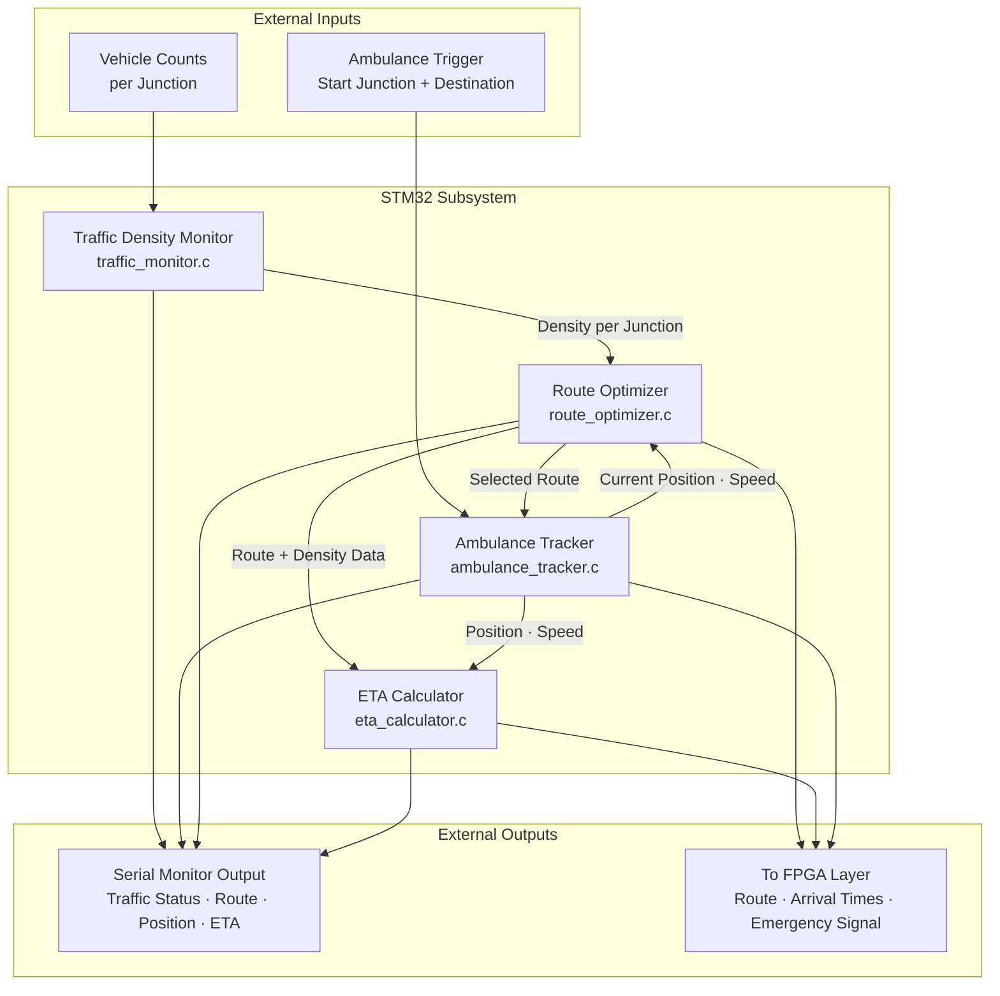
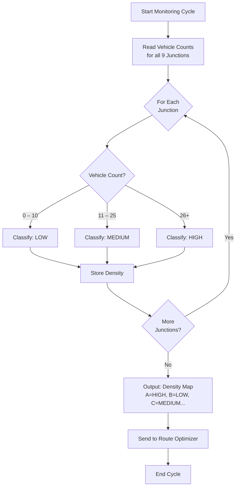
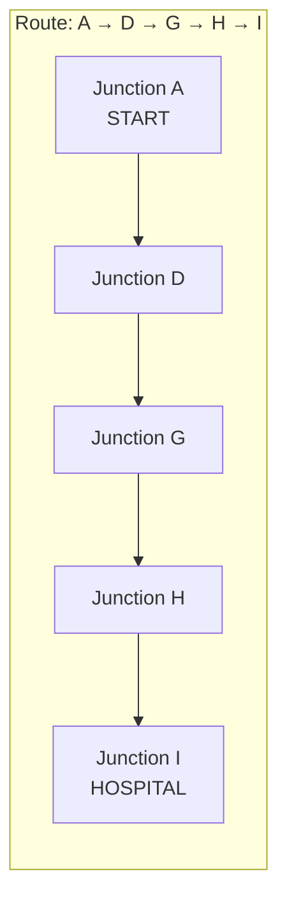
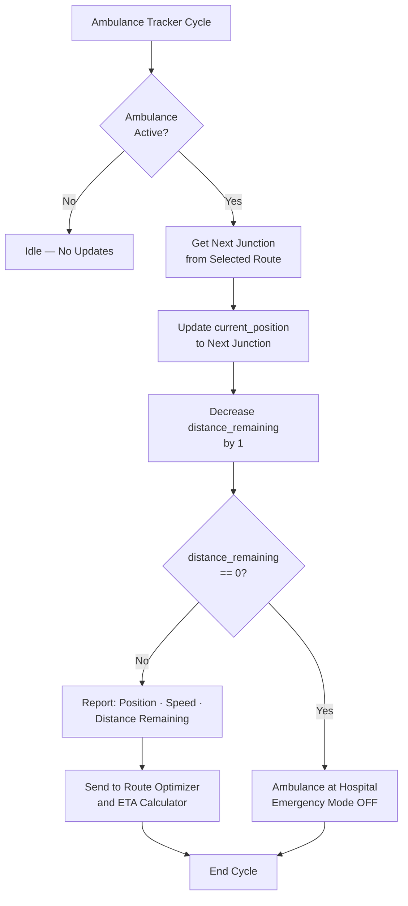
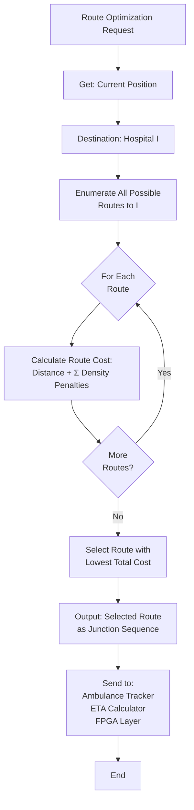
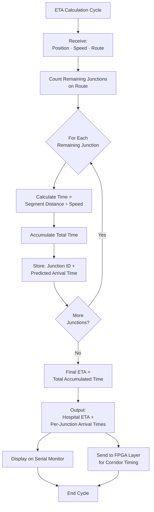
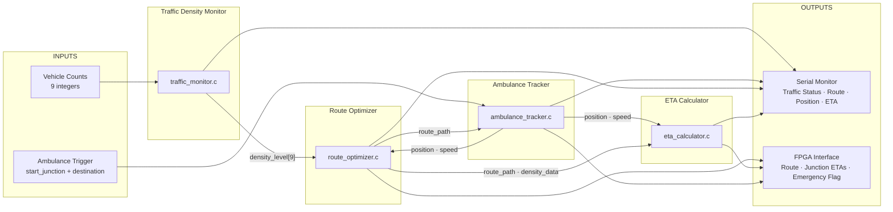
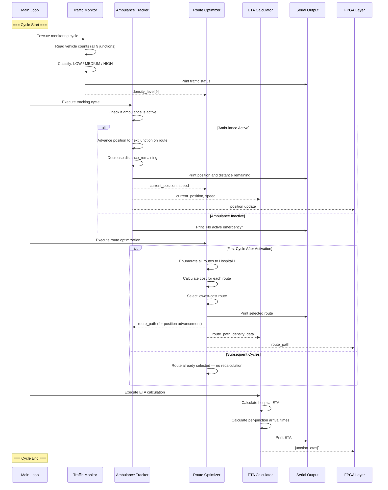
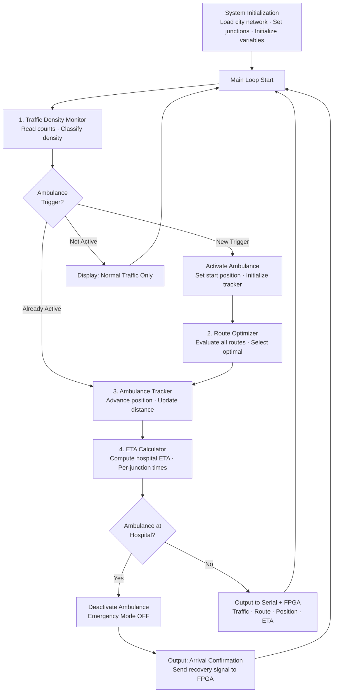
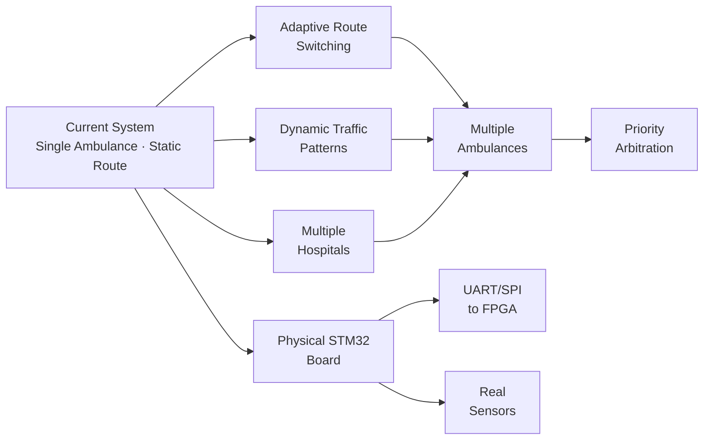

# STM32 Subsystem Design

**Predictive Ambulance Green Corridor Generator — Traffic Intelligence Layer**

---

## Table of Contents

1. [STM32 Responsibilities](#1-stm32-responsibilities)
2. [Module Architecture](#2-module-architecture)
3. [Traffic Density Monitor](#3-traffic-density-monitor)
4. [Ambulance Tracker](#4-ambulance-tracker)
5. [Route Optimizer](#5-route-optimizer)
6. [ETA Calculator](#6-eta-calculator)
7. [Data Structures](#7-data-structures)
8. [Inputs and Outputs](#8-inputs-and-outputs)
9. [Module Interactions](#9-module-interactions)
10. [Execution Cycle](#10-execution-cycle)
11. [Test Cases](#11-test-cases)
12. [Future Improvements](#12-future-improvements)

---

## 1. STM32 Responsibilities

The STM32 layer acts as the **central traffic management computer** — the brain of the entire system. It is implemented in STM32CubeIDE using the STM32F103C8 (or equivalent) microcontroller.

### What STM32 Owns

| Responsibility | Description |
|---|---|
| **Traffic Density Collection** | Monitors vehicle counts at all 9 junctions and classifies congestion levels |
| **Ambulance Tracking** | Continuously tracks ambulance position, speed, and distance remaining |
| **Route Calculation** | Evaluates all possible routes and selects the optimal path to Hospital (I) |
| **ETA Calculation** | Estimates arrival time at the hospital and at each intermediate junction |
| **Communication with FPGA** | Sends route, predicted arrival times, and emergency signals to the Vivado control layer |

### What STM32 Does NOT Own

| Not Responsible For | Handled By |
|---|---|
| Signal state transitions | Vivado FPGA (FSMs) |
| LED / LCD hardware control | Tinkercad (Arduino UNO) |
| Performance analytics | Python Dashboard |
| Green corridor sequencing | Vivado FPGA (Corridor Controller) |

> **Design rationale:** STM32 represents a realistic embedded traffic management system. All intelligence — monitoring, tracking, routing, prediction — runs on the microcontroller, while physical signal control is delegated to dedicated digital logic hardware (FPGA).

---

## 2. Module Architecture

The STM32 subsystem contains **4 modules**, each in its own source file. Modules communicate through shared data structures and are executed sequentially in a main loop cycle.

### Module Architecture Diagram



### File Structure

| File | Module | Purpose |
|---|---|---|
| `traffic_monitor.c` / `.h` | Traffic Density Monitor | Vehicle count simulation and density classification |
| `ambulance_tracker.c` | Ambulance Tracker | Position tracking and movement simulation |
| `route_optimizer.c` | Route Optimizer | Route evaluation and selection |
| `eta_calculator.c` | ETA Calculator | Time-of-arrival estimation |

---

## 3. Traffic Density Monitor

### Purpose

Determine the congestion level at each of the 9 junctions in the city network by counting vehicles and classifying the result.

### Classification Thresholds

| Vehicle Count | Density Level | Meaning |
|---|---|---|
| 0 – 10 | **LOW** | Free-flowing traffic, minimal delay |
| 11 – 25 | **MEDIUM** | Moderate congestion, some delay expected |
| 26+ | **HIGH** | Heavy congestion, significant delay |

### Monitoring Scope

The monitor tracks all 9 junctions simultaneously:

```
Junction A    Junction B    Junction C
Junction D    Junction E    Junction F
Junction G    Junction H    Junction I
```

### Processing Flow



### Example Output

| Junction | Vehicle Count | Density |
|---|---|---|
| A | 35 | HIGH |
| B | 12 | MEDIUM |
| C | 48 | HIGH |
| D | 5 | LOW |
| E | 18 | MEDIUM |
| F | 8 | LOW |
| G | 3 | LOW |
| H | 22 | MEDIUM |
| I | 0 | LOW (Hospital) |

### Simulation Method

In the simulated environment, vehicle counts are generated programmatically. No physical sensors are used. Values can be:

- **Hardcoded** for deterministic testing
- **Randomized within ranges** for scenario variety
- **Button-driven** when paired with Tinkercad (each button press = 1 vehicle)

---

## 4. Ambulance Tracker

### Purpose

Track the ambulance's real-time state as it moves junction-to-junction through the city network toward Hospital (I).

### Tracked State

| Variable | Type | Description | Example |
|---|---|---|---|
| `current_position` | Junction ID | The junction the ambulance is currently at | `D` |
| `destination` | Junction ID | Target hospital — always Junction I | `I` |
| `speed` | Numeric | Current travel speed (simulated) | `40` |
| `distance_remaining` | Integer | Junctions left to traverse on the route | `3` |

### Movement Model

The ambulance moves in **discrete steps** — one junction per cycle. It does not occupy positions between junctions.



### Position Update Flow



### Activation Trigger

The ambulance is activated by an external trigger (button press in Tinkercad or programmatic command in STM32). Upon activation:

1. `current_position` is set to the starting junction.
2. `destination` is set to Junction I (Hospital).
3. `speed` is initialized.
4. The Route Optimizer is invoked to select the best path.
5. `distance_remaining` is calculated from the selected route length.

### Coordinate System

The ambulance uses **virtual coordinates** — junction IDs only. There is no GPS, no physical coordinates, and no continuous position interpolation. Position is always a discrete junction label (A through I).

---

## 5. Route Optimizer

### Purpose

Select the fastest route from the ambulance's current position to Hospital (I) by evaluating all possible paths against two weighted factors.

### Decision Factors

| Factor | Source | Influence |
|---|---|---|
| **Road Distance** | City network topology (fixed) | Shorter routes are preferred |
| **Traffic Density** | Traffic Density Monitor (dynamic) | Routes through HIGH-density junctions are penalized |

### City Network Topology

```
A --- B --- C
|         |         |
D --- E --- F
|         |         |
G --- H --- I
```

All edges are bidirectional. Each edge represents one road segment of equal base distance.

### Route Evaluation Process



### Example: Route Selection from Junction A

**Scenario:** Junction B = HIGH density, Junction D = LOW density

| Route | Path | Distance | Density Penalty | Total Cost |
|---|---|---|---|---|
| Route 1 | A → B → C → F → I | 4 segments | HIGH (B) + varies | Higher cost |
| Route 2 | A → D → G → H → I | 4 segments | LOW (D) + varies | **Lower cost** ✓ |
| Route 3 | A → D → E → F → I | 4 segments | LOW (D) + MEDIUM (E) | Moderate cost |
| Route 4 | A → B → E → H → I | 4 segments | HIGH (B) + MEDIUM (E) | Higher cost |

**Result:** Route 2 (A → D → G → H → I) is selected because it avoids the HIGH-density junction.

### Route Re-evaluation

In the current scope, the route is calculated **once** at ambulance activation and remains fixed throughout the journey.

> **Stretch goal (future):** Adaptive Route Switching — re-evaluate the route at each junction if traffic conditions change during transit.

---

## 6. ETA Calculator

### Purpose

Estimate the ambulance's time of arrival at Hospital (I) and — critically — at each **intermediate junction** along the selected route. The per-junction predictions drive the FPGA's corridor timing.

### ETA Computation

```
ETA at Hospital = Distance Remaining ÷ Current Speed
```

Each road segment has an associated traversal time based on the ambulance's speed. The total ETA is the sum of traversal times for all remaining segments.

### Per-Junction Arrival Prediction

For a route A → D → G → H → I with the ambulance currently at Junction A:

| Junction | Segments Away | Predicted Arrival |
|---|---|---|
| D | 1 | ~20 seconds |
| G | 2 | ~45 seconds |
| H | 3 | ~70 seconds |
| I (Hospital) | 4 | ~95 seconds |

### ETA Calculation Flow



### ETA Update Behavior

The ETA is **recalculated every cycle** as the ambulance advances. With each junction crossed:

- The list of remaining junctions shrinks.
- The total ETA decreases.
- Per-junction predictions are updated for the remaining junctions.

### Importance for Green Corridor

The per-junction arrival predictions are the **critical input** to the FPGA Corridor Controller. They tell the FPGA:

- **Which signal** needs to change (the next junction on the route)
- **When to start preparing** (~45 seconds before arrival)
- **When to activate green** (~20 seconds before arrival)

Without accurate per-junction ETAs, the corridor cannot be predictive — it would only be reactive.

---

## 7. Data Structures

The following data structures are shared across the 4 STM32 modules. They represent the complete state of the system at any point during execution.

### Junction Data

| Field | Type | Description |
|---|---|---|
| `junction_id` | Character (A–I) | Unique identifier for each junction |
| `vehicle_count` | Integer | Current number of vehicles at this junction |
| `density_level` | Enum: LOW, MEDIUM, HIGH | Classified congestion level |

### Ambulance Data

| Field | Type | Description |
|---|---|---|
| `is_active` | Boolean | Whether an emergency is currently in progress |
| `current_position` | Junction ID | The junction the ambulance is currently at |
| `destination` | Junction ID | Always Junction I (Hospital) |
| `speed` | Integer | Current travel speed |
| `distance_remaining` | Integer | Junctions left to reach hospital |

### Route Data

| Field | Type | Description |
|---|---|---|
| `route_path` | Array of Junction IDs | Ordered sequence of junctions from start to hospital |
| `route_length` | Integer | Number of junctions in the route |
| `total_cost` | Integer | Combined distance + density penalty score |

### ETA Data

| Field | Type | Description |
|---|---|---|
| `hospital_eta` | Time (seconds) | Estimated time to reach Hospital (I) |
| `junction_etas` | Array of (Junction ID, Time) | Predicted arrival time at each remaining junction |

### City Network Data

| Field | Type | Description |
|---|---|---|
| `adjacency` | 9×9 matrix or adjacency list | Which junctions connect to which |
| `segment_distance` | Per-edge value | Distance between adjacent junctions |

---

## 8. Inputs and Outputs

### Module-Level I/O



### System-Level I/O Summary

| Direction | Data | Source / Destination |
|---|---|---|
| **Input** | Vehicle counts (9 values) | Tinkercad buttons or programmatic simulation |
| **Input** | Ambulance trigger (start junction) | Tinkercad ambulance button or programmatic command |
| **Output** | Traffic density per junction | Serial monitor display |
| **Output** | Selected route (junction sequence) | Serial monitor + FPGA layer |
| **Output** | Ambulance position | Serial monitor + FPGA layer |
| **Output** | Hospital ETA | Serial monitor + LCD display |
| **Output** | Per-junction arrival times | FPGA Corridor Controller |
| **Output** | Emergency active flag | FPGA Emergency Override FSM |

---

## 9. Module Interactions

### Interaction Sequence

The 4 modules interact in a strict sequence during each execution cycle. The following diagram shows the complete data exchange during a single cycle with an active ambulance.



### Interaction Rules

| Rule | Description |
|---|---|
| **Sequential execution** | Modules run in order: TM → AT → RO → ETA. No parallel execution. |
| **Single-cycle data** | Each module uses data produced in the **current** cycle. No multi-cycle buffering. |
| **Route calculated once** | The Route Optimizer selects a route on the first cycle after activation. It does not recalculate on subsequent cycles (in the current scope). |
| **ETA updates every cycle** | The ETA Calculator runs every cycle and produces updated predictions as the ambulance advances. |
| **Unidirectional to FPGA** | The STM32 sends data to the FPGA layer. The FPGA does not send data back to the STM32. |

---

## 10. Execution Cycle

### Main Loop Structure

The STM32 firmware runs a continuous main loop. Each iteration represents one **system cycle** — the time unit in which the ambulance can advance one junction.



### Cycle Phases

| Phase | Duration | Active Modules | Outputs |
|---|---|---|---|
| **Normal (no ambulance)** | Continuous | Traffic Monitor only | Density status per junction |
| **Activation (first cycle)** | 1 cycle | All 4 modules | Route selected, initial ETA computed |
| **Transit (each cycle)** | Per junction | Tracker + ETA Calculator | Updated position, decreasing ETA |
| **Arrival (final cycle)** | 1 cycle | Tracker | Deactivation signal, recovery trigger |

### Timing

In the simulated environment, each cycle executes as fast as the processor allows. For demonstration purposes, a **delay** can be inserted between cycles to simulate real-time ambulance movement (e.g., 1–2 seconds per junction traversal).

---

## 11. Test Cases

All test cases are derived from the project's documented test scenarios. Each test validates a specific aspect of the STM32 subsystem.

### Test Case 1: Traffic Density Classification

| Parameter | Value |
|---|---|
| **Objective** | Verify density classification at threshold boundaries |
| **Input** | Vehicle counts: A=0, B=10, C=11, D=25, E=26, F=50, G=5, H=15, I=0 |
| **Expected Output** | A=LOW, B=LOW, C=MEDIUM, D=MEDIUM, E=HIGH, F=HIGH, G=LOW, H=MEDIUM, I=LOW |
| **Validates** | Threshold correctness at boundary values (10/11 and 25/26) |

### Test Case 2: Route Selection — Avoid Congestion

| Parameter | Value |
|---|---|
| **Objective** | Verify that the optimizer avoids HIGH-density junctions |
| **Input** | Ambulance at A. Traffic: B=HIGH, C=HIGH. D=LOW, G=LOW, H=LOW |
| **Expected Output** | Selected route: A → D → G → H → I (avoids B and C) |
| **Validates** | Traffic-aware route selection |

### Test Case 3: Route Selection — Shortest Path

| Parameter | Value |
|---|---|
| **Objective** | Verify that the optimizer selects the shortest path when traffic is equal |
| **Input** | Ambulance at A. All junctions = LOW traffic |
| **Expected Output** | Shortest available route to I |
| **Validates** | Distance-based optimization when density is not a factor |

### Test Case 4: Ambulance Tracking — Full Journey

| Parameter | Value |
|---|---|
| **Objective** | Verify position updates across a complete journey |
| **Input** | Ambulance at A. Route: A → D → G → H → I |
| **Expected Output** | Position sequence: A → D → G → H → I. Distance remaining: 4 → 3 → 2 → 1 → 0 |
| **Validates** | Correct position advancement and distance tracking |

### Test Case 5: ETA Calculation — Decreasing Over Time

| Parameter | Value |
|---|---|
| **Objective** | Verify ETA decreases as ambulance advances |
| **Input** | Ambulance at A. Route: A → D → G → H → I. Constant speed |
| **Expected Output** | ETA at cycle 1 > ETA at cycle 2 > ETA at cycle 3 > ETA at cycle 4. Final ETA = 0 |
| **Validates** | Monotonically decreasing ETA with correct final value |

### Test Case 6: No Ambulance — Normal Operation

| Parameter | Value |
|---|---|
| **Objective** | Verify system operates correctly without an ambulance |
| **Input** | No ambulance trigger. Vehicle counts at all junctions |
| **Expected Output** | Traffic density displayed. No route, no ETA, no position updates |
| **Validates** | System stability in non-emergency mode |

### Test Case 7: Per-Junction ETA Accuracy

| Parameter | Value |
|---|---|
| **Objective** | Verify per-junction arrival predictions are correct |
| **Input** | Ambulance at A. Route: A → D → G → H → I. Known speed |
| **Expected Output** | Arrival at D = 1 segment time. Arrival at G = 2 × segment time. Etc. |
| **Validates** | Per-junction ETA correctness (used by FPGA for corridor timing) |

### Test Summary Matrix

| Test | Module Tested | Input Type | Pass Criteria |
|---|---|---|---|
| TC-1 | Traffic Monitor | Boundary values | Correct classification at 10/11 and 25/26 |
| TC-2 | Route Optimizer | HIGH-density scenario | Route avoids congested junctions |
| TC-3 | Route Optimizer | Equal density | Shortest path selected |
| TC-4 | Ambulance Tracker | Full journey | Correct position at each cycle |
| TC-5 | ETA Calculator | Full journey | ETA decreases monotonically to 0 |
| TC-6 | All modules | No ambulance | No crash, no spurious output |
| TC-7 | ETA Calculator | Known speed | Predictions match hand calculations |

---

## 12. Future Improvements

The following improvements are possible within the existing architecture. None require fundamental redesign — they extend the current module capabilities.

### Near-Term (Stretch Goals)

| Improvement | Affected Module | Description |
|---|---|---|
| **Adaptive Route Switching** | Route Optimizer | Re-evaluate the route at each junction during transit. If traffic on the current path increases, switch to a better alternative mid-journey. |
| **Dynamic Traffic Patterns** | Traffic Monitor | Instead of static or hardcoded vehicle counts, simulate traffic that changes over time — junctions gradually becoming more or less congested. |
| **Multiple Starting Scenarios** | Ambulance Tracker | Automated testing from all 8 possible starting junctions (A through H) with different traffic patterns. |

### Medium-Term (Scope Expansion)

| Improvement | Affected Module | Description |
|---|---|---|
| **Multiple Ambulances** | Ambulance Tracker + Route Optimizer | Track 2+ ambulances simultaneously. Route Optimizer must consider that two ambulances should not share the same corridor. |
| **Multiple Hospitals** | Route Optimizer | Evaluate routes to several hospitals and select the nearest or least-congested option. |
| **Priority Arbitration** | New module | When multiple ambulances are active, assign priority based on urgency or proximity to hospital. |

### Long-Term (Hardware Migration)

| Improvement | Affected Module | Description |
|---|---|---|
| **Physical STM32 Board** | All modules | Deploy firmware to a physical STM32F103C8 (Blue Pill) board. All `.c` files should compile and run without modification. |
| **UART/SPI to FPGA** | Communication layer | Replace simulated data transfer with physical serial communication between STM32 and FPGA board. |
| **Real Sensors** | Traffic Monitor | Replace simulated vehicle counts with IR sensors, ultrasonic sensors, or inductive loop detectors at each junction. |

### Improvement Dependency Chain



> **Recommendation:** Adaptive Route Switching is the highest-value improvement. It extends the Route Optimizer to recalculate at each junction, turning a single decision into a continuous optimization — significantly more impressive for project evaluation.

---

> **Document scope:** STM32 subsystem design only. For FPGA signal control, see the [System Architecture Document](docs/SYSTEM_ARCHITECTURE.md). For the full system, see [ARCHITECTURE.md](ARCHITECTURE.md).
