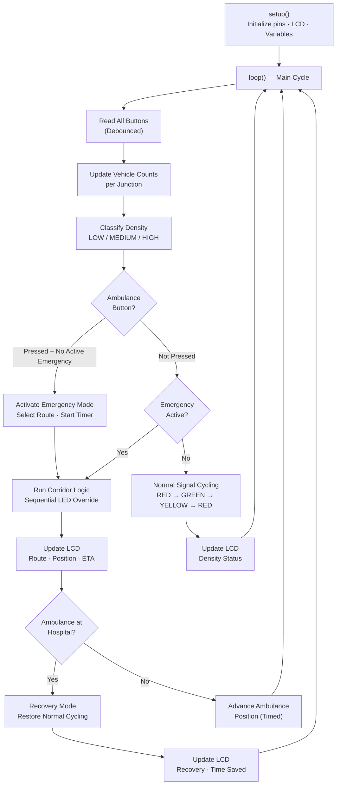
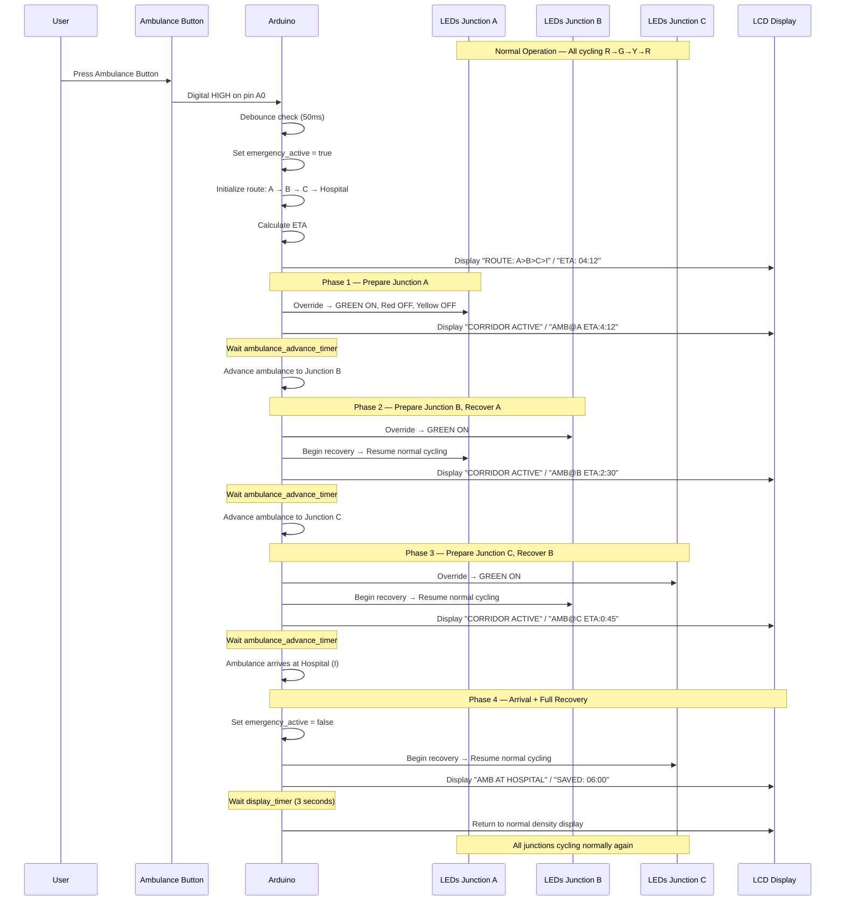

# Tinkercad Subsystem Design

**Predictive Ambulance Green Corridor Generator — Smart City Visualization Layer**

---

## Table of Contents

1. [Purpose](#1-purpose)
2. [Components Required](#2-components-required)
3. [Circuit Layout](#3-circuit-layout)
4. [LED Mapping](#4-led-mapping)
5. [Button Mapping](#5-button-mapping)
6. [LCD Mapping](#6-lcd-mapping)
7. [Arduino Responsibilities](#7-arduino-responsibilities)
8. [Simulation Scenarios](#8-simulation-scenarios)
9. [Emergency Trigger Flow](#9-emergency-trigger-flow)
10. [Demonstration Flow](#10-demonstration-flow)
11. [Testing Procedures](#11-testing-procedures)

---

## 1. Purpose

The Tinkercad simulation provides a **physical-world visual demonstration** of the Predictive Ambulance Green Corridor system. It translates the abstract logic of the STM32 intelligence layer and the FPGA signal control layer into something immediately visible and understandable.

### What Tinkercad Demonstrates

| Demonstration | How |
|---|---|
| **Traffic signals at intersections** | 9 LEDs (3 colors × 3 intersections) show RED, YELLOW, GREEN states |
| **Vehicle density sensing** | Push buttons simulate vehicles arriving at junctions |
| **Ambulance emergency activation** | A dedicated push button triggers the green corridor |
| **Signal coordination** | LEDs change in sequence to show the corridor opening ahead of the ambulance |
| **Status reporting** | An LCD displays ETA, corridor status, and signal states |

### What Tinkercad Does NOT Do

| Not Responsible For | Handled By |
|---|---|
| Traffic density classification | STM32 (Traffic Monitor) |
| Route selection logic | STM32 (Route Optimizer) |
| ETA computation | STM32 (ETA Calculator) |
| FSM state transitions | Vivado (Verilog FSMs) |
| Performance analytics | Python Dashboard |

> **Design rationale:** Tinkercad provides the visual layer that makes the project tangible during demonstrations. An evaluator can see LEDs change, press a button to trigger an ambulance, and read the LCD — creating an immediate, intuitive understanding of the system's behavior.

---

## 2. Components Required

### Bill of Materials

| # | Component | Quantity | Purpose |
|---|---|---|---|
| 1 | **Arduino UNO** | 1 | Simulation controller — runs all signal logic and I/O |
| 2 | **Red LED** | 3 | RED signal for Intersections A, B, C |
| 3 | **Yellow LED** | 3 | YELLOW signal for Intersections A, B, C |
| 4 | **Green LED** | 3 | GREEN signal for Intersections A, B, C |
| 5 | **Push Button (Vehicle)** | 3 | Vehicle density sensor for Intersections A, B, C |
| 6 | **Push Button (Ambulance)** | 1 | Emergency trigger — activates green corridor |
| 7 | **220Ω Resistor** | 9 | Current limiting for each LED |
| 8 | **10kΩ Resistor** | 4 | Pull-down for each push button |
| 9 | **16×2 LCD Display** | 1 | Status display — ETA, corridor state, signal info |
| 10 | **10kΩ Potentiometer** | 1 | LCD contrast adjustment |
| 11 | **Breadboard** | 1–2 | Component mounting and wiring |
| 12 | **Jumper Wires** | ~40 | Connections between Arduino and components |

### Component Count Summary

| Category | Count |
|---|---|
| LEDs | 9 (3 Red + 3 Yellow + 3 Green) |
| Buttons | 4 (3 Vehicle + 1 Ambulance) |
| Resistors | 13 (9 × 220Ω for LEDs + 4 × 10kΩ for buttons) |
| Display | 1 (16×2 LCD) |
| Controller | 1 (Arduino UNO) |
| Total discrete components | 28 |

> **Tinkercad constraint:** Keep the circuit manageable. 3 intersections (not all 9) are simulated visually. This is sufficient to demonstrate sequential corridor activation while keeping the circuit readable.

---

## 3. Circuit Layout

### Pin Allocation

The Arduino UNO has 14 digital pins (D0–D13) and 6 analog pins (A0–A5). The following allocation uses 21 pins total.

#### LED Pins (Digital Output)

| Pin | Component | Junction | Signal Color |
|---|---|---|---|
| D2 | LED | Intersection A | 🔴 Red |
| D3 | LED | Intersection A | 🟡 Yellow |
| D4 | LED | Intersection A | 🟢 Green |
| D5 | LED | Intersection B | 🔴 Red |
| D6 | LED | Intersection B | 🟡 Yellow |
| D7 | LED | Intersection B | 🟢 Green |
| D8 | LED | Intersection C | 🔴 Red |
| D9 | LED | Intersection C | 🟡 Yellow |
| D10 | LED | Intersection C | 🟢 Green |

#### Button Pins (Digital Input)

| Pin | Component | Function |
|---|---|---|
| D11 | Push Button | Vehicle sensor — Intersection A |
| D12 | Push Button | Vehicle sensor — Intersection B |
| D13 | Push Button | Vehicle sensor — Intersection C |
| A0 | Push Button | **Ambulance trigger** (emergency activation) |

#### LCD Pins

| Pin | LCD Pin | Function |
|---|---|---|
| A1 | RS | Register Select |
| A2 | EN | Enable |
| A3 | D4 | Data bit 4 |
| A4 | D5 | Data bit 5 |
| A5 | D6 | Data bit 6 |
| D1 | D7 | Data bit 7 |

> The LCD operates in **4-bit mode** to conserve pins. Pins D0 and RW are tied to ground.

### Pin Summary

| Pin Range | Allocation | Count |
|---|---|---|
| D1 | LCD D7 | 1 |
| D2 – D10 | LEDs (9 LEDs) | 9 |
| D11 – D13 | Vehicle buttons (3) | 3 |
| A0 | Ambulance button | 1 |
| A1 – A5 | LCD control + data (5) | 5 |
| **Total** | | **19 pins used** |

### ASCII Circuit Layout

```
                            ARDUINO UNO
                     ┌──────────────────────┐
                     │                      │
    [LCD 16×2]◄──────┤ A1-A5, D1            │
                     │                      │
                     │ D2  ──── [220Ω] ──── [RED LED A]
    Intersection A   │ D3  ──── [220Ω] ──── [YEL LED A]
                     │ D4  ──── [220Ω] ──── [GRN LED A]
                     │                      │
                     │ D5  ──── [220Ω] ──── [RED LED B]
    Intersection B   │ D6  ──── [220Ω] ──── [YEL LED B]
                     │ D7  ──── [220Ω] ──── [GRN LED B]
                     │                      │
                     │ D8  ──── [220Ω] ──── [RED LED C]
    Intersection C   │ D9  ──── [220Ω] ──── [YEL LED C]
                     │ D10 ──── [220Ω] ──── [GRN LED C]
                     │                      │
    Vehicle Btn A    │ D11 ◄─── [10kΩ↓] ─── [BTN A]
    Vehicle Btn B    │ D12 ◄─── [10kΩ↓] ─── [BTN B]
    Vehicle Btn C    │ D13 ◄─── [10kΩ↓] ─── [BTN C]
                     │                      │
    Ambulance Btn    │ A0  ◄─── [10kΩ↓] ─── [BTN AMB] 🚑
                     │                      │
                     │ 5V  ──── VCC rail     │
                     │ GND ──── GND rail     │
                     └──────────────────────┘

    [10kΩ↓] = Pull-down resistor to GND
    [220Ω]  = Current-limiting resistor in series with LED
```

### Breadboard Layout Suggestion

```
┌─────────────────────────────────────────────────────────────────┐
│                        BREADBOARD                               │
│                                                                 │
│  ── VCC RAIL ──────────────────────────────────────────────── + │
│  ── GND RAIL ──────────────────────────────────────────────── − │
│                                                                 │
│  Section 1: Intersection A                                      │
│  ┌───────────────────┐                                          │
│  │ 🔴 R   🟡 Y   🟢 G │  ← LEDs with 220Ω each to Arduino    │
│  │ [BTN A]           │  ← Vehicle button with 10kΩ pull-down   │
│  └───────────────────┘                                          │
│                                                                 │
│  Section 2: Intersection B                                      │
│  ┌───────────────────┐                                          │
│  │ 🔴 R   🟡 Y   🟢 G │                                        │
│  │ [BTN B]           │                                          │
│  └───────────────────┘                                          │
│                                                                 │
│  Section 3: Intersection C                                      │
│  ┌───────────────────┐                                          │
│  │ 🔴 R   🟡 Y   🟢 G │                                        │
│  │ [BTN C]           │                                          │
│  └───────────────────┘                                          │
│                                                                 │
│  Section 4: Control                                             │
│  ┌───────────────────┐                                          │
│  │ [BTN AMB] 🚑      │  ← Ambulance trigger with 10kΩ         │
│  │ [LCD 16×2]        │  ← LCD with potentiometer for contrast  │
│  └───────────────────┘                                          │
│                                                                 │
│  ── GND RAIL ──────────────────────────────────────────────── − │
└─────────────────────────────────────────────────────────────────┘
```

---

## 4. LED Mapping

### Physical-to-Logical Mapping

Each intersection has 3 LEDs representing the 3 possible signal states. At any given time, **exactly one LED per intersection** is lit.

| Intersection | Red LED | Yellow LED | Green LED | Arduino Pins |
|---|---|---|---|---|
| **Intersection A** | LED_A_R | LED_A_Y | LED_A_G | D2, D3, D4 |
| **Intersection B** | LED_B_R | LED_B_Y | LED_B_G | D5, D6, D7 |
| **Intersection C** | LED_C_R | LED_C_Y | LED_C_G | D8, D9, D10 |

### LED State Truth Table

For each intersection, the 3 LEDs follow this truth table:

| Signal State | Red LED | Yellow LED | Green LED |
|---|---|---|---|
| **RED** | ON | OFF | OFF |
| **YELLOW** | OFF | ON | OFF |
| **GREEN** | OFF | OFF | ON |
| **ALL OFF** (reset) | OFF | OFF | OFF |

> Only one LED per intersection is ON at any time. Lighting two or more simultaneously indicates a fault.

### LED States During System Modes

| System Mode | LED A | LED B | LED C |
|---|---|---|---|
| **Normal operation** | Cycling R→G→Y→R | Cycling R→G→Y→R | Cycling R→G→Y→R |
| **Corridor active (ambulance at A)** | 🟢 GREEN (forced) | 🟢 GREEN (preparing) | Cycling normally |
| **Corridor active (ambulance at B)** | Cycling (recovering) | 🟢 GREEN (forced) | 🟢 GREEN (preparing) |
| **Corridor active (ambulance at C)** | Cycling normally | Cycling (recovering) | 🟢 GREEN (forced) |
| **System reset** | 🔴 RED (all) | 🔴 RED (all) | 🔴 RED (all) |

### LED Wiring Detail

Each LED circuit follows this pattern:

```
Arduino Pin (D2–D10) ──── [220Ω Resistor] ──── [LED Anode(+)] ──── [LED Cathode(−)] ──── GND
```

- **220Ω** limits current to approximately 15 mA at 5V (safe operating range for standard LEDs).
- The **anode** (longer leg) connects to the resistor side.
- The **cathode** (shorter leg) connects to the GND rail.

---

## 5. Button Mapping

### Button Functions

| Button | Pin | Function | Press Behavior |
|---|---|---|---|
| **Vehicle A** | D11 | Vehicle density sensor for Intersection A | Each press increments the vehicle count at Junction A by 1 |
| **Vehicle B** | D12 | Vehicle density sensor for Intersection B | Each press increments the vehicle count at Junction B by 1 |
| **Vehicle C** | D13 | Vehicle density sensor for Intersection C | Each press increments the vehicle count at Junction C by 1 |
| **Ambulance** 🚑 | A0 | Emergency corridor trigger | Single press activates emergency mode and green corridor |

### Button Behavior Detail

#### Vehicle Buttons (D11, D12, D13)

| Aspect | Behavior |
|---|---|
| **Press type** | Momentary — active only while held |
| **Debounce** | Software debounce required (10–50 ms delay) |
| **Counter behavior** | Each press adds 1 to the junction's vehicle count |
| **Density classification** | After each press, count is classified: 0–10 = LOW, 11–25 = MEDIUM, 26+ = HIGH |
| **Visual feedback** | Count and density can be shown on LCD |

#### Ambulance Button (A0)

| Aspect | Behavior |
|---|---|
| **Press type** | Momentary — single press toggles emergency mode |
| **Debounce** | Software debounce required |
| **First press** | Activates ambulance emergency mode |
| **Effect** | Triggers green corridor sequence on all 3 intersections |
| **During active emergency** | Button press is ignored (no re-trigger until current emergency completes) |

### Button Wiring Detail

Each button uses a **pull-down resistor** configuration:

```
                  VCC (5V)
                    │
                [BUTTON]
                    │
Arduino Pin ────────┤
                    │
                [10kΩ]
                    │
                   GND
```

- **Unpressed:** Pin reads LOW (pulled to GND through 10kΩ).
- **Pressed:** Pin reads HIGH (connected to VCC through the button).

---

## 6. LCD Mapping

### LCD Configuration

| Parameter | Value |
|---|---|
| **Display type** | 16×2 character LCD (HD44780 compatible) |
| **Interface mode** | 4-bit (uses D4–D7 data lines only) |
| **Characters per line** | 16 |
| **Total lines** | 2 |
| **Contrast control** | 10kΩ potentiometer on V0 pin |

### LCD Pin Connections

| LCD Pin | Name | Arduino Pin | Function |
|---|---|---|---|
| 1 | VSS | GND | Ground |
| 2 | VDD | 5V | Power supply |
| 3 | V0 | Potentiometer wiper | Contrast adjustment |
| 4 | RS | A1 | Register Select (0=command, 1=data) |
| 5 | RW | GND | Read/Write (tied LOW = Write only) |
| 6 | EN | A2 | Enable pulse |
| 7–10 | D0–D3 | — | Not connected (4-bit mode) |
| 11 | D4 | A3 | Data bit 4 |
| 12 | D5 | A4 | Data bit 5 |
| 13 | D6 | A5 | Data bit 6 |
| 14 | D7 | D1 | Data bit 7 |
| 15 | LED+ | 5V (through 220Ω) | Backlight anode |
| 16 | LED− | GND | Backlight cathode |

### LCD Display Layouts

The LCD alternates between display modes depending on system state.

#### Normal Mode Display

```
┌────────────────┐
│A:LOW  B:MED    │  ← Line 1: Traffic density at Intersections A, B
│C:HI   NORMAL   │  ← Line 2: Density at C + System mode
└────────────────┘
```

#### Emergency Mode Display — Route Selected

```
┌────────────────┐
│ROUTE: A>B>C>I  │  ← Line 1: Selected ambulance route
│ETA: 04:12      │  ← Line 2: Estimated time of arrival
└────────────────┘
```

#### Emergency Mode Display — Corridor Active

```
┌────────────────┐
│CORRIDOR ACTIVE │  ← Line 1: System status
│AMB@B  ETA:2:30 │  ← Line 2: Ambulance position + remaining ETA
└────────────────┘
```

#### Emergency Mode Display — Arrival

```
┌────────────────┐
│AMB AT HOSPITAL │  ← Line 1: Arrival confirmation
│SAVED: 06:00    │  ← Line 2: Time saved vs. normal travel
└────────────────┘
```

#### Recovery Mode Display

```
┌────────────────┐
│RECOVERING...   │  ← Line 1: Recovery in progress
│SIGNALS NORMAL  │  ← Line 2: Status update
└────────────────┘
```

### LCD Update Frequency

| Mode | Update Rate | Reason |
|---|---|---|
| Normal | Every 2 seconds | Density changes slowly; fast updates cause flicker |
| Emergency | Every 500 ms | ETA and position change frequently during transit |
| Recovery | Every 1 second | Brief transitional display |

---

## 7. Arduino Responsibilities

The Arduino UNO acts as the **simulation controller** — it runs the logic that in the full system would be distributed between the STM32 and FPGA layers.

### Functional Responsibilities

| # | Responsibility | Full System Equivalent |
|---|---|---|
| 1 | Read vehicle button presses and count vehicles | STM32 Traffic Monitor |
| 2 | Classify density at each intersection (LOW/MEDIUM/HIGH) | STM32 Traffic Monitor |
| 3 | Detect ambulance button press and activate emergency mode | STM32 Ambulance Tracker |
| 4 | Cycle LEDs through RED → GREEN → YELLOW → RED during normal mode | Vivado Signal FSM |
| 5 | Override LEDs to GREEN sequentially during emergency mode | Vivado Emergency FSM + Corridor Controller |
| 6 | Recover LEDs to normal cycling after ambulance passes | Vivado Recovery |
| 7 | Display status on LCD (density, route, ETA, corridor state) | Dashboard + LCD Interface |

### Arduino Program Structure



### Timing Management

Since the Arduino runs in a single-threaded loop, timing is managed using `millis()` (not `delay()`):

| Timer | Duration | Purpose |
|---|---|---|
| Signal cycle timer | ~2–3 seconds per state | Controls RED → GREEN → YELLOW → RED transitions |
| Ambulance advance timer | ~1–2 seconds per junction | Simulates ambulance travel speed |
| LCD refresh timer | 500 ms – 2 seconds | Prevents display flicker |
| Button debounce timer | 50 ms | Prevents multiple registrations from a single press |

---

## 8. Simulation Scenarios

### Scenario 1: Normal Traffic Only

| Parameter | Value |
|---|---|
| **Setup** | No ambulance button pressed |
| **Action** | Press vehicle buttons to increment counts at A, B, C |
| **Expected LED behavior** | All 3 intersections cycle RED → GREEN → YELLOW → RED independently |
| **Expected LCD** | Shows density per junction (e.g., A:LOW B:MED C:HI) |
| **Duration** | Run for 3+ complete signal cycles |

### Scenario 2: Ambulance Emergency — Full Corridor

| Parameter | Value |
|---|---|
| **Setup** | Some vehicle buttons pressed (varied traffic) |
| **Action** | Press ambulance button |
| **Expected LED behavior** | Intersection A → GREEN, then B → GREEN, then C → GREEN (sequential) |
| **Expected LCD** | Shows route, ETA, corridor status |
| **Duration** | From trigger through all 3 junctions to hospital arrival |

### Scenario 3: Corridor Recovery

| Parameter | Value |
|---|---|
| **Setup** | Complete Scenario 2 (ambulance reaches hospital) |
| **Action** | Observe automatic recovery |
| **Expected LED behavior** | Intersections return to normal cycling: A first, then B, then C |
| **Expected LCD** | Shows "RECOVERING..." then "SIGNALS NORMAL" then returns to density display |
| **Duration** | Recovery takes ~5–10 seconds |

### Scenario 4: High Density Display

| Parameter | Value |
|---|---|
| **Setup** | Press vehicle button A more than 26 times |
| **Action** | Observe LCD density update |
| **Expected LED behavior** | Normal cycling (no ambulance) |
| **Expected LCD** | Shows A:HI |
| **Duration** | Brief — verify classification |

### Scenario 5: Ambulance During Active Signal Cycle

| Parameter | Value |
|---|---|
| **Setup** | Intersection A is in RED state; B is in GREEN state |
| **Action** | Press ambulance button |
| **Expected LED behavior** | A immediately transitions to GREEN (override); B stays GREEN; C begins PREPARE |
| **Expected LCD** | Shows emergency mode activation |
| **Duration** | Verify override interrupts normal cycle correctly |

---

## 9. Emergency Trigger Flow

### Complete Emergency Sequence



### Emergency State Machine (Arduino-side)

| State | LED Behavior | LCD Display | Transition |
|---|---|---|---|
| **NORMAL** | All cycling independently | Density per junction | Ambulance button pressed → EMERGENCY |
| **EMERGENCY_ROUTE** | No change yet | Route + ETA | Route displayed for 1 second → CORRIDOR_A |
| **CORRIDOR_A** | A = forced GREEN | AMB@A + ETA | Timer expires → CORRIDOR_B |
| **CORRIDOR_B** | B = forced GREEN, A recovering | AMB@B + ETA | Timer expires → CORRIDOR_C |
| **CORRIDOR_C** | C = forced GREEN, B recovering | AMB@C + ETA | Timer expires → ARRIVAL |
| **ARRIVAL** | C recovering | "AMB AT HOSPITAL" + time saved | Display timer → RECOVERY |
| **RECOVERY** | All returning to normal | "RECOVERING..." | All signals normal → NORMAL |

---

## 10. Demonstration Flow

### Step-by-Step Demo Script

This script is designed for a **5–8 minute live demonstration**.

#### Step 1: Show Normal Traffic (1 minute)

| Action | Expected Result |
|---|---|
| Power on the circuit | All LEDs cycle: RED → GREEN → YELLOW → RED |
| Point out the 3 intersections | Explain each group of 3 LEDs |
| Show LCD | Displays density as LOW for all junctions |
| Press vehicle button A several times | LCD updates A density: LOW → MEDIUM → HIGH |

**Talking point:** _"The system monitors traffic density at each intersection. Right now, all signals are operating on normal fixed-timing cycles."_

#### Step 2: Activate Ambulance (30 seconds)

| Action | Expected Result |
|---|---|
| Press ambulance button 🚑 | LCD shows: "ROUTE: A>B>C>I" / "ETA: 04:12" |
| Point to LCD | Explain route selection and ETA display |

**Talking point:** _"An emergency has been triggered. The system has selected the optimal route and calculated the estimated time of arrival."_

#### Step 3: Observe Corridor Activation (2–3 minutes)

| Action | Expected Result |
|---|---|
| Watch Intersection A | A's LEDs switch to GREEN (corridor active) |
| Watch LCD | Updates to "AMB@A" with ETA countdown |
| Wait for ambulance to advance | A begins recovering, B switches to GREEN |
| Watch LCD | Updates to "AMB@B" with reduced ETA |
| Wait for ambulance to advance | B begins recovering, C switches to GREEN |
| Watch LCD | Updates to "AMB@C" with nearly zero ETA |

**Talking point:** _"Watch how the signals change BEFORE the ambulance arrives at each intersection. This is predictive coordination — the corridor opens ahead of the ambulance, not behind it."_

#### Step 4: Observe Arrival (30 seconds)

| Action | Expected Result |
|---|---|
| Wait for ambulance to reach Hospital | LCD shows "AMB AT HOSPITAL" / "SAVED: 06:00" |
| Point to time saved | Explain normal time vs. corridor time |

**Talking point:** _"The ambulance has reached the hospital. The system saved 6 minutes compared to normal travel time — that's a 40% reduction in travel time."_

#### Step 5: Observe Recovery (30 seconds)

| Action | Expected Result |
|---|---|
| Watch LEDs | All intersections return to normal cycling |
| Watch LCD | Shows "RECOVERING..." then returns to density display |

**Talking point:** _"After the emergency, all signals automatically recover to normal operation. The system is ready for the next emergency."_

#### Step 6: Show Analytics (1 minute)

| Action | Expected Result |
|---|---|
| Reference dashboard (if available) | Show time saved, efficiency, signals cleared |
| Or reference LCD saved-time display | Summarize performance metrics |

**Talking point:** _"The analytics show that the predictive corridor consistently reduces travel time by 40–50%, with over 90% corridor efficiency."_

### Demo Timing Summary

| Phase | Duration | What Happens |
|---|---|---|
| Normal traffic | ~60 seconds | Show cycling, button presses, density |
| Ambulance trigger | ~30 seconds | Show route selection, ETA |
| Corridor active | ~120–180 seconds | Show sequential GREEN activation |
| Arrival | ~30 seconds | Show hospital arrival, time saved |
| Recovery | ~30 seconds | Show return to normal |
| Analytics | ~60 seconds | Summarize results |
| **Total** | **~5–7 minutes** | |

---

## 11. Testing Procedures

### Test 1: LED Wiring Verification

| Procedure | Expected | Pass/Fail |
|---|---|---|
| Set pin D2 HIGH, all others LOW | Red LED A lights, nothing else | ☐ |
| Set pin D3 HIGH, all others LOW | Yellow LED A lights, nothing else | ☐ |
| Set pin D4 HIGH, all others LOW | Green LED A lights, nothing else | ☐ |
| Repeat for D5–D7 (Intersection B) | Correct LEDs light individually | ☐ |
| Repeat for D8–D10 (Intersection C) | Correct LEDs light individually | ☐ |
| Set all pins LOW | No LEDs lit | ☐ |

### Test 2: Button Wiring Verification

| Procedure | Expected | Pass/Fail |
|---|---|---|
| Press Vehicle A button, read pin D11 | Serial prints HIGH | ☐ |
| Release Vehicle A button, read pin D11 | Serial prints LOW | ☐ |
| Repeat for Vehicle B (D12) | Correct HIGH/LOW | ☐ |
| Repeat for Vehicle C (D13) | Correct HIGH/LOW | ☐ |
| Press Ambulance button, read pin A0 | Serial prints HIGH | ☐ |
| Release Ambulance button, read pin A0 | Serial prints LOW | ☐ |

### Test 3: LCD Display Verification

| Procedure | Expected | Pass/Fail |
|---|---|---|
| Power on circuit | LCD backlight ON | ☐ |
| Adjust potentiometer | Characters become visible | ☐ |
| Display "HELLO WORLD" on line 1 | Text appears correctly | ☐ |
| Display "TEST 12345" on line 2 | Text appears on second line | ☐ |
| Display full 16 characters on each line | No truncation, no overflow | ☐ |

### Test 4: Normal Signal Cycling

| Procedure | Expected | Pass/Fail |
|---|---|---|
| Run program with no button presses | All 3 intersections cycle R→G→Y→R | ☐ |
| Observe timing | Each state lasts the configured duration | ☐ |
| Observe independence | Intersections cycle independently (not synchronized) | ☐ |
| Run for 5+ complete cycles | No glitches, no stuck states | ☐ |

### Test 5: Vehicle Count Increment

| Procedure | Expected | Pass/Fail |
|---|---|---|
| Press Vehicle A button 5 times | LCD shows A count = 5 or A:LOW | ☐ |
| Press Vehicle A button 6 more times (total 11) | LCD shows A:MEDIUM | ☐ |
| Press Vehicle A button 15 more times (total 26) | LCD shows A:HIGH | ☐ |
| Repeat for Intersections B and C | Same classification behavior | ☐ |

### Test 6: Emergency Trigger

| Procedure | Expected | Pass/Fail |
|---|---|---|
| Press ambulance button | LCD switches to route + ETA display | ☐ |
| Observe Intersection A | LEDs switch to GREEN immediately | ☐ |
| Wait for ambulance advance | Intersection B switches to GREEN, A begins recovery | ☐ |
| Wait for ambulance advance | Intersection C switches to GREEN, B begins recovery | ☐ |
| Wait for arrival | LCD shows "AMB AT HOSPITAL" with time saved | ☐ |
| Observe recovery | All intersections return to normal cycling | ☐ |

### Test 7: Button Ignored During Emergency

| Procedure | Expected | Pass/Fail |
|---|---|---|
| Trigger emergency (press ambulance button) | Emergency activates | ☐ |
| Press ambulance button again during active corridor | No effect — emergency continues uninterrupted | ☐ |
| Wait for recovery to complete | Emergency fully deactivated | ☐ |
| Press ambulance button | New emergency activates normally | ☐ |

### Test 8: Full Demonstration Run

| Procedure | Expected | Pass/Fail |
|---|---|---|
| Run complete demo script (Steps 1–6) | All steps execute correctly | ☐ |
| No LED glitches during any phase | Smooth transitions | ☐ |
| LCD updates correctly at each phase | No garbled text, no flicker | ☐ |
| Time saved value is displayed correctly | Positive, reasonable value | ☐ |
| System is reusable after recovery | Second emergency can be triggered | ☐ |

### Screenshot Capture Checklist

| # | Screenshot | File Name | Status |
|---|---|---|---|
| 1 | Full circuit overview | `tinkercad/screenshots/circuit_overview.png` | ☐ |
| 2 | Normal operation — all cycling | `tinkercad/screenshots/normal_operation.png` | ☐ |
| 3 | Ambulance triggered — route on LCD | `tinkercad/screenshots/emergency_trigger.png` | ☐ |
| 4 | Corridor active — A GREEN | `tinkercad/screenshots/corridor_junction_a.png` | ☐ |
| 5 | Corridor active — B GREEN, A recovering | `tinkercad/screenshots/corridor_junction_b.png` | ☐ |
| 6 | Corridor active — C GREEN | `tinkercad/screenshots/corridor_junction_c.png` | ☐ |
| 7 | Arrival — hospital message on LCD | `tinkercad/screenshots/arrival.png` | ☐ |
| 8 | Recovery — all signals returning to normal | `tinkercad/screenshots/recovery.png` | ☐ |

---

> **Document scope:** Tinkercad visualization layer only. For STM32 intelligence, see [STM32_DESIGN.md](STM32_DESIGN.md). For FPGA signal control, see [VIVADO_DESIGN.md](VIVADO_DESIGN.md). For the full system, see [ARCHITECTURE.md](ARCHITECTURE.md).
