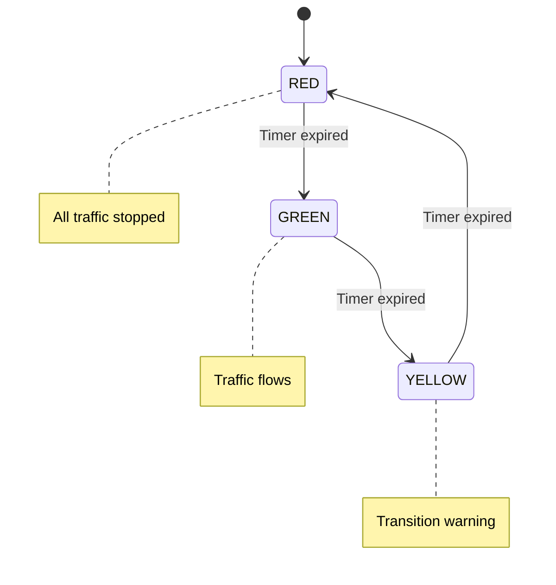
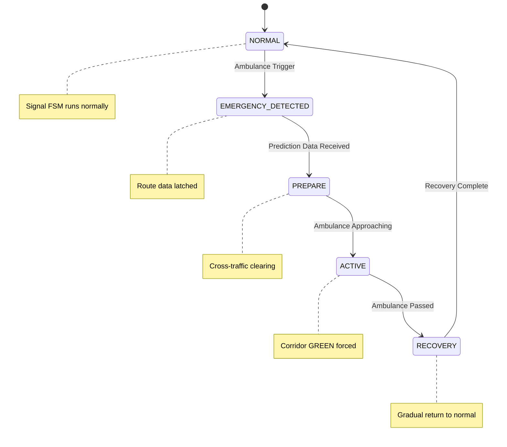
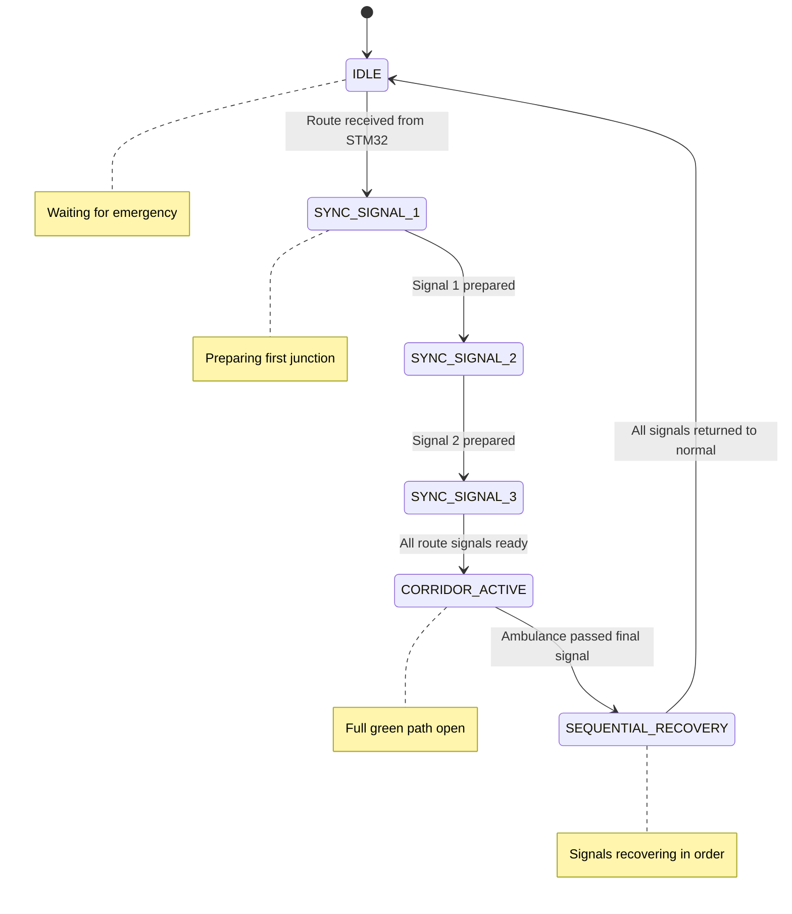
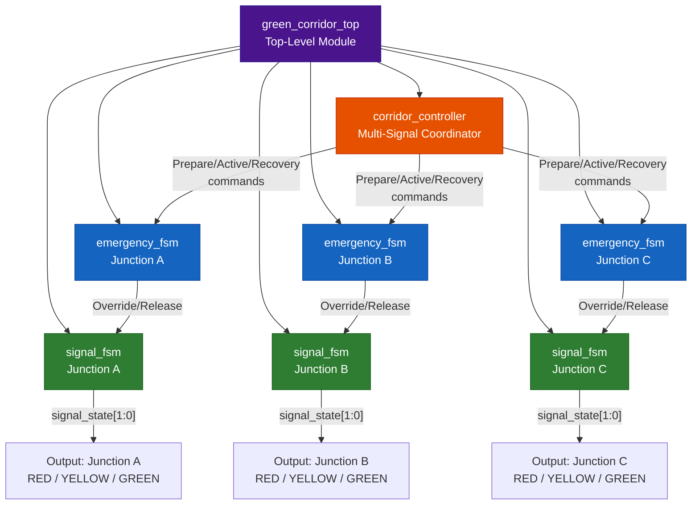
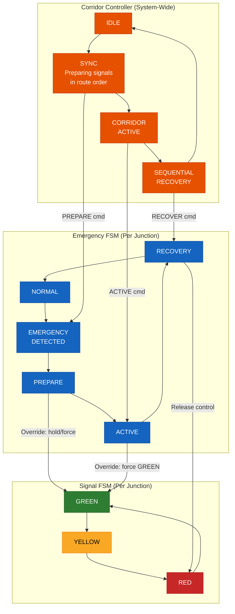
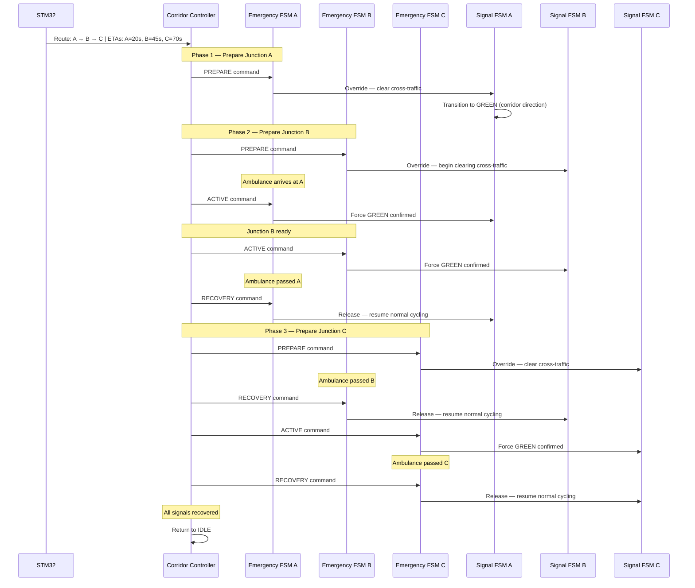
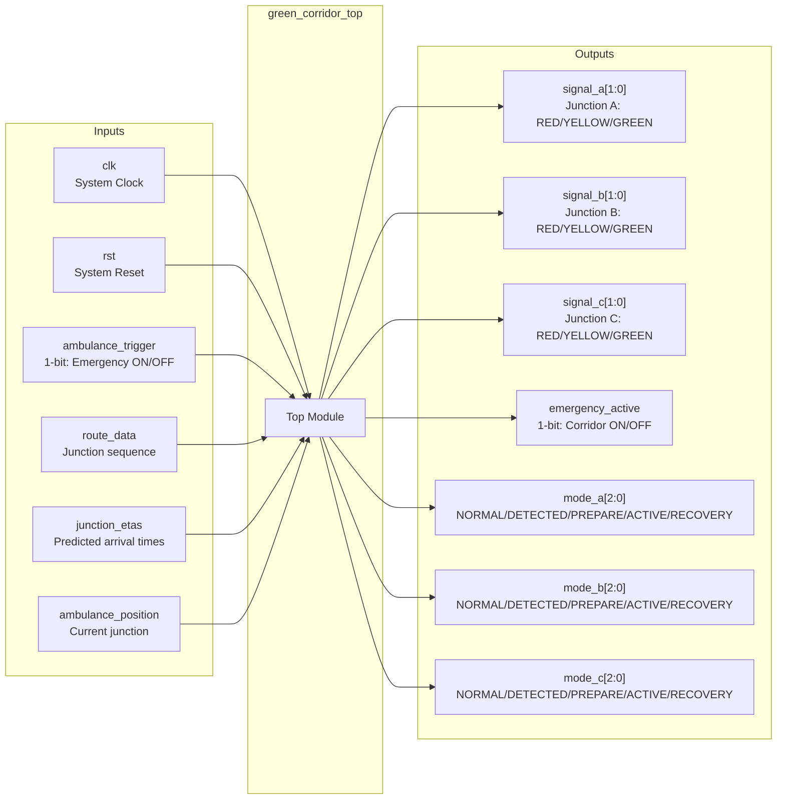
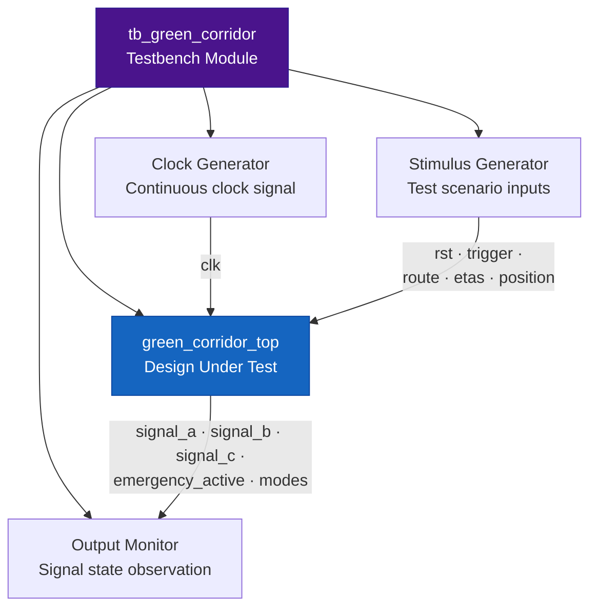
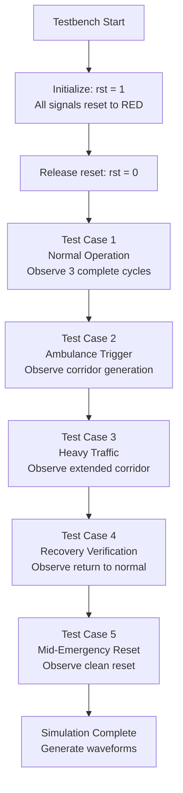

# FPGA Subsystem Design

**Predictive Ambulance Green Corridor Generator — Signal Control Layer**

---

## Table of Contents

1. [FPGA Responsibilities](#1-fpga-responsibilities)
2. [Signal FSM](#2-signal-fsm)
3. [Emergency FSM](#3-emergency-fsm)
4. [Corridor Controller](#4-corridor-controller)
5. [Top Module](#5-top-module)
6. [State Transition Tables](#6-state-transition-tables)
7. [FSM Diagrams](#7-fsm-diagrams)
8. [Signal Synchronization Strategy](#8-signal-synchronization-strategy)
9. [Inputs and Outputs](#9-inputs-and-outputs)
10. [Testbench Design](#10-testbench-design)
11. [Simulation Methodology](#11-simulation-methodology)
12. [Waveform Expectations](#12-waveform-expectations)

---

## 1. FPGA Responsibilities

The FPGA layer — implemented in **Vivado** using **Verilog** — handles all traffic signal control logic. It operates as the **digital hardware controller** for the city's traffic signal infrastructure.

### What the FPGA Owns

| Responsibility | Description |
|---|---|
| **Normal Traffic Signal Cycling** | Each junction's signal cycles RED → GREEN → YELLOW → RED under normal conditions |
| **Emergency Override** | When an ambulance is detected, the FPGA overrides normal cycling and transitions to emergency mode |
| **Green Corridor Logic** | Coordinates multiple signals along the ambulance's route to create a continuous green path |
| **Signal Synchronization** | Ensures signals open in the correct sequential order matching the ambulance's direction of travel |
| **Recovery** | After the ambulance passes, restores signals to normal cycling without abrupt transitions |

### What the FPGA Does NOT Own

| Not Responsible For | Handled By |
|---|---|
| Traffic density monitoring | STM32 (Traffic Monitor) |
| Route selection | STM32 (Route Optimizer) |
| Ambulance position tracking | STM32 (Ambulance Tracker) |
| ETA computation | STM32 (ETA Calculator) |
| Visual LED/LCD output | Tinkercad (Arduino UNO) |
| Performance analytics | Python Dashboard |

> **Design rationale:** Traffic signal control is naturally a **digital logic problem** — deterministic, state-based, and timing-critical. Implementing it as FSMs in an FPGA demonstrates RTL design and DLD skills, which are core ECE competencies.

### Vivado Project Configuration

| Parameter | Value |
|---|---|
| Project Name | GreenCorridorController |
| Project Type | RTL Project |
| HDL Language | Verilog |
| Simulation | Behavioral simulation (no synthesis/implementation required) |

---

## 2. Signal FSM

### Purpose

Control the normal traffic signal cycling at each junction. Every junction in the 9-junction network has its own instance of this FSM.

### States

| State | Signal Output | Description |
|---|---|---|
| **RED** | 🔴 Stop | All traffic at this junction is stopped |
| **GREEN** | 🟢 Go | Traffic flows through this junction |
| **YELLOW** | 🟡 Caution | Transition warning — signal is about to turn red |

### State Sequence

The Signal FSM cycles through a fixed sequence continuously during normal operation:

```
RED → GREEN → YELLOW → RED → GREEN → YELLOW → RED → ...
```

Each state persists for a defined number of clock cycles before transitioning to the next.

### Timing

| State | Duration | Purpose |
|---|---|---|
| RED | Configurable (e.g., 30 clock cycles) | Stop period |
| GREEN | Configurable (e.g., 25 clock cycles) | Flow period |
| YELLOW | Configurable (e.g., 5 clock cycles) | Transition warning |

### Behavior Rules

| Rule | Description |
|---|---|
| **Autonomous cycling** | The FSM cycles independently when no emergency is active |
| **Clock-driven** | All transitions are synchronous to the system clock |
| **Suspendable** | When the Emergency FSM takes control, the Signal FSM pauses at its current state |
| **Resumable** | After emergency recovery, the Signal FSM resumes from the state it was paused at |

### Signal FSM Diagram



---

## 3. Emergency FSM

### Purpose

Manage the complete emergency override lifecycle — from ambulance detection through corridor activation to signal recovery. This FSM takes priority over the Signal FSM when an emergency is active.

### States

| State | Description | Signal FSM Status |
|---|---|---|
| **NORMAL** | No emergency active. Signal FSM operates independently. | Running |
| **EMERGENCY_DETECTED** | Ambulance trigger received. System begins processing. | Running (briefly) |
| **PREPARE** | Corridor preparation in progress. Cross-traffic is being cleared. | Suspended |
| **ACTIVE** | Green corridor is fully active. Ambulance corridor direction is green. | Overridden |
| **RECOVERY** | Ambulance has passed. Signals are transitioning back to normal. | Resuming |

### State Transitions

| From | To | Trigger | Action |
|---|---|---|---|
| NORMAL | EMERGENCY_DETECTED | Ambulance trigger signal received from STM32 | Latch ambulance route data |
| EMERGENCY_DETECTED | PREPARE | Per-junction prediction data received from STM32 | Begin clearing cross-traffic at upcoming junctions |
| PREPARE | ACTIVE | Preparation complete; ambulance approaching | Force corridor signals to GREEN |
| ACTIVE | RECOVERY | Ambulance has passed through this junction | Begin transitioning cross-traffic back |
| RECOVERY | NORMAL | Recovery timer expired; signals stable | Release control back to Signal FSM |

### Emergency FSM Diagram



### Priority

The Emergency FSM **always** takes precedence over the Signal FSM. When the Emergency FSM is in any state other than NORMAL, the Signal FSM is either suspended or overridden.

---

## 4. Corridor Controller

### Purpose

Coordinate multiple signals along the ambulance's route so that they open in the **correct sequential order** — creating a wave of green signals ahead of the ambulance.

### Core Principle

The corridor does not activate all signals simultaneously. Instead, it activates them **progressively**:

1. The signal at the ambulance's **next** junction opens first.
2. The signal at the junction **after that** begins preparing.
3. As the ambulance advances, each signal transitions from PREPARE → ACTIVE → RECOVERY in sequence.

### Coordination Sequence

For an ambulance traveling along route A → D → G → H → I:

| Time | Signal A | Signal D | Signal G | Signal H |
|---|---|---|---|---|
| T=0 (Trigger) | GREEN | PREPARE | Normal | Normal |
| T=1 (Ambulance at A) | RECOVERY | GREEN | PREPARE | Normal |
| T=2 (Ambulance at D) | NORMAL | RECOVERY | GREEN | PREPARE |
| T=3 (Ambulance at G) | NORMAL | NORMAL | RECOVERY | GREEN |
| T=4 (Ambulance at H) | NORMAL | NORMAL | NORMAL | RECOVERY |

### Corridor Controller Diagram



### Corridor Controller Responsibilities

| Responsibility | Description |
|---|---|
| **Route parsing** | Receives the junction sequence from STM32 and identifies which signals to control |
| **Timing coordination** | Uses per-junction ETAs from STM32 to schedule when each signal should begin preparation |
| **Sequential activation** | Opens signals one at a time in route order — never all at once |
| **Sequential recovery** | Recovers signals in the order the ambulance passed them |
| **FSM arbitration** | Tells each junction's Emergency FSM when to enter PREPARE, ACTIVE, and RECOVERY states |

---

## 5. Top Module

### Purpose

The top-level module (`green_corridor_top.v`) connects all three FSM components into a single, unified FPGA design. It serves as the integration point and the interface to the outside world.

### Module Hierarchy



> **Purple** = Top Module · **Orange** = Corridor Controller · **Blue** = Emergency FSMs · **Green** = Signal FSMs

### Instantiation Pattern

The top module instantiates:

| Component | Count | Reason |
|---|---|---|
| `signal_fsm` | 3 instances (one per demonstrated intersection) | Each junction needs independent normal signal cycling |
| `emergency_fsm` | 3 instances (one per demonstrated intersection) | Each junction needs independent emergency override capability |
| `corridor_controller` | 1 instance | One central coordinator manages all signals along the route |

### Top Module Connections

| Source | Destination | Data |
|---|---|---|
| External (STM32) | `corridor_controller` | Route data, per-junction ETAs, ambulance trigger |
| `corridor_controller` | Each `emergency_fsm` | PREPARE / ACTIVE / RECOVERY commands per junction |
| Each `emergency_fsm` | Corresponding `signal_fsm` | Override signal (suspend normal cycling) or release signal (resume) |
| Each `signal_fsm` | External (Tinkercad LEDs) | 2-bit signal state: RED / YELLOW / GREEN |
| External | All modules | System clock (`clk`) and reset (`rst`) |

---

## 6. State Transition Tables

### Signal FSM Transition Table

| Current State | Condition | Next State | Output |
|---|---|---|---|
| RED | Timer expired AND no override | GREEN | Signal = GREEN |
| RED | Override active | RED (held) | Signal = RED (frozen) |
| GREEN | Timer expired AND no override | YELLOW | Signal = YELLOW |
| GREEN | Override active | GREEN (held) | Signal = GREEN (frozen, corridor) |
| YELLOW | Timer expired AND no override | RED | Signal = RED |
| YELLOW | Override to GREEN | GREEN | Signal = GREEN (forced) |

### Emergency FSM Transition Table

| Current State | Input Condition | Next State | Output Action |
|---|---|---|---|
| NORMAL | `ambulance_trigger == 1` | EMERGENCY_DETECTED | Latch route data; alert corridor controller |
| NORMAL | `ambulance_trigger == 0` | NORMAL | No action |
| EMERGENCY_DETECTED | `prediction_valid == 1` | PREPARE | Begin cross-traffic clearance |
| EMERGENCY_DETECTED | `prediction_valid == 0` | EMERGENCY_DETECTED | Wait for prediction data |
| PREPARE | `ambulance_approaching == 1` | ACTIVE | Override Signal FSM to GREEN |
| PREPARE | `ambulance_approaching == 0` | PREPARE | Continue clearing cross-traffic |
| ACTIVE | `ambulance_passed == 1` | RECOVERY | Begin signal restoration |
| ACTIVE | `ambulance_passed == 0` | ACTIVE | Maintain GREEN override |
| RECOVERY | `recovery_timer_expired == 1` | NORMAL | Release Signal FSM; resume normal cycling |
| RECOVERY | `recovery_timer_expired == 0` | RECOVERY | Continue gradual restoration |

### Corridor Controller Transition Table

| Current State | Input Condition | Next State | Output Action |
|---|---|---|---|
| IDLE | `route_valid == 1` | SYNC_SIGNAL_1 | Send PREPARE to first junction's Emergency FSM |
| SYNC_SIGNAL_1 | Signal 1 in PREPARE | SYNC_SIGNAL_2 | Send PREPARE to second junction's Emergency FSM |
| SYNC_SIGNAL_2 | Signal 2 in PREPARE | SYNC_SIGNAL_3 | Send PREPARE to third junction's Emergency FSM |
| SYNC_SIGNAL_3 | All signals prepared | CORRIDOR_ACTIVE | All route signals ready for ambulance |
| CORRIDOR_ACTIVE | Ambulance passed last signal | SEQUENTIAL_RECOVERY | Begin recovering signals in passage order |
| SEQUENTIAL_RECOVERY | All signals in NORMAL | IDLE | Corridor fully deactivated |

---

## 7. FSM Diagrams

### Complete FSM Interaction Overview

This diagram shows how the three FSMs interact at a single junction, demonstrating the override and release mechanism.



### Multi-Junction Corridor Timeline

This diagram shows how the corridor activates across 3 junctions over time.

```mermaid
gantt
    title Green Corridor Timeline — 3 Junctions
    dateFormat X
    axisFormat %s

    section Junction A
    Normal Cycling          :done, a1, 0, 10
    PREPARE                 :active, a2, 10, 15
    ACTIVE (GREEN)          :crit, a3, 15, 25
    RECOVERY                :a4, 25, 30
    Normal Resumed          :done, a5, 30, 50

    section Junction B
    Normal Cycling          :done, b1, 0, 15
    PREPARE                 :active, b2, 15, 20
    ACTIVE (GREEN)          :crit, b3, 20, 30
    RECOVERY                :b4, 30, 35
    Normal Resumed          :done, b5, 35, 50

    section Junction C
    Normal Cycling          :done, c1, 0, 20
    PREPARE                 :active, c2, 20, 25
    ACTIVE (GREEN)          :crit, c3, 25, 35
    RECOVERY                :c4, 35, 40
    Normal Resumed          :done, c5, 40, 50

    section Ambulance
    At Junction A           :milestone, m1, 15, 15
    At Junction B           :milestone, m2, 25, 25
    At Junction C           :milestone, m3, 35, 35
```



> Each junction's PREPARE phase begins **before** the ambulance arrives. The ACTIVE phase coincides with the ambulance's passage. Recovery begins after the ambulance has passed.

---

## 8. Signal Synchronization Strategy

### Problem

If all signals on the route turn GREEN simultaneously:

- Cross-traffic at distant junctions is stopped unnecessarily early.
- The corridor occupies more of the network for longer than needed.
- Recovery is delayed.

### Solution: Progressive Wave

The Corridor Controller implements a **progressive green wave** — signals activate sequentially, timed to the ambulance's predicted arrival at each junction.

### Synchronization Rules

| Rule | Description |
|---|---|
| **Rule 1: Sequential order** | Signals activate in the order they appear on the route (first junction first) |
| **Rule 2: Prediction-timed** | Each signal's PREPARE phase begins based on the ETA data from STM32, not on a fixed timer |
| **Rule 3: No premature activation** | A junction does not enter PREPARE until the junction before it has entered ACTIVE |
| **Rule 4: Sequential recovery** | Signals recover in the order the ambulance passed them (first junction recovers first) |
| **Rule 5: Minimum disruption** | Only signals on the ambulance's route are affected. Other junctions continue normal cycling |

### Synchronization Sequence Diagram



---

## 9. Inputs and Outputs

### Top Module Interface



### Input Specification

| Signal | Width | Source | Description |
|---|---|---|---|
| `clk` | 1 bit | System | Master clock for all synchronous logic |
| `rst` | 1 bit | System | Active-high synchronous reset |
| `ambulance_trigger` | 1 bit | STM32 | Rising edge activates emergency mode |
| `route_data` | Variable | STM32 | Encoded junction sequence for the selected route |
| `junction_etas` | Variable | STM32 | Predicted arrival time at each junction on the route |
| `ambulance_position` | Variable | STM32 | Current junction of the ambulance (for tracking passage) |

### Output Specification

| Signal | Width | Destination | Description |
|---|---|---|---|
| `signal_a` | 2 bits | Tinkercad LEDs | Junction A signal state: 00=RED, 01=GREEN, 10=YELLOW |
| `signal_b` | 2 bits | Tinkercad LEDs | Junction B signal state |
| `signal_c` | 2 bits | Tinkercad LEDs | Junction C signal state |
| `emergency_active` | 1 bit | Status indicator | 1 when any corridor is active; 0 otherwise |
| `mode_a` | 3 bits | Debug / testbench | Emergency FSM state for Junction A |
| `mode_b` | 3 bits | Debug / testbench | Emergency FSM state for Junction B |
| `mode_c` | 3 bits | Debug / testbench | Emergency FSM state for Junction C |

### Signal Encoding

| Value | `signal_x[1:0]` | Meaning |
|---|---|---|
| `2'b00` | RED | Stop |
| `2'b01` | GREEN | Go |
| `2'b10` | YELLOW | Caution |

| Value | `mode_x[2:0]` | Emergency State |
|---|---|---|
| `3'b000` | NORMAL | No emergency |
| `3'b001` | EMERGENCY_DETECTED | Trigger received |
| `3'b010` | PREPARE | Clearing cross-traffic |
| `3'b011` | ACTIVE | Corridor GREEN |
| `3'b100` | RECOVERY | Returning to normal |

---

## 10. Testbench Design

### Testbench File

`tb_green_corridor.v` — a self-contained testbench that instantiates `green_corridor_top` and applies 5 test scenarios.

### Testbench Architecture



### Test Cases

#### Test Case 1: Normal Traffic Operation

| Parameter | Value |
|---|---|
| **Objective** | Verify signals cycle correctly when no emergency is active |
| **Setup** | `ambulance_trigger = 0` for entire test duration |
| **Duration** | Multiple complete RED → GREEN → YELLOW → RED cycles |
| **Expected** | All 3 junctions cycle independently; `emergency_active = 0` throughout |
| **Observe** | `signal_a`, `signal_b`, `signal_c` waveforms show regular cycling |

#### Test Case 2: Single Ambulance — Green Corridor

| Parameter | Value |
|---|---|
| **Objective** | Verify complete corridor generation for a single ambulance |
| **Setup** | Assert `ambulance_trigger`; provide route A → B → C; provide ETAs |
| **Duration** | From trigger through corridor activation to full recovery |
| **Expected** | Signals transition: NORMAL → DETECTED → PREPARE → ACTIVE → RECOVERY → NORMAL |
| **Observe** | Sequential GREEN activation on `signal_a` → `signal_b` → `signal_c` |

#### Test Case 3: Heavy Traffic Scenario

| Parameter | Value |
|---|---|
| **Objective** | Verify signal behavior when the FPGA receives a route through congested junctions |
| **Setup** | Provide route data; simulate ambulance traversal at slower speed (longer ETAs) |
| **Duration** | Extended corridor duration |
| **Expected** | Corridor remains active longer; recovery occurs correctly after extended ACTIVE phase |
| **Observe** | ACTIVE state duration matches the longer ETA values |

#### Test Case 4: Recovery Mode

| Parameter | Value |
|---|---|
| **Objective** | Verify signals return to normal operation after ambulance passes |
| **Setup** | Complete a full corridor activation, then observe recovery |
| **Duration** | Focus on the RECOVERY → NORMAL transition |
| **Expected** | Each junction recovers sequentially; Signal FSMs resume normal cycling |
| **Observe** | `mode_x` returns to `3'b000` (NORMAL); signal cycling resumes |

#### Test Case 5: System Reset

| Parameter | Value |
|---|---|
| **Objective** | Verify system resets cleanly to a known initial state |
| **Setup** | Assert `rst` during various states (normal, mid-emergency, mid-recovery) |
| **Duration** | Brief |
| **Expected** | All FSMs return to initial states; all signals go to RED; `emergency_active = 0` |
| **Observe** | All state outputs reset to initial values |

### Testbench Execution Flow



---

## 11. Simulation Methodology

### Simulation Type

**Behavioral simulation** in Vivado. No synthesis, no implementation, no bitstream generation. The design is verified entirely through simulation waveforms.

### Simulation Steps

| Step | Action | Purpose |
|---|---|---|
| 1 | Create Vivado project with all RTL source files | Project setup |
| 2 | Add testbench as simulation source | Testbench registration |
| 3 | Set `tb_green_corridor` as top-level simulation module | Simulation target |
| 4 | Run behavioral simulation | Execute test cases |
| 5 | Open waveform viewer | Observe signal behavior |
| 6 | Add all relevant signals to waveform window | Visibility |
| 7 | Run simulation for required duration | Complete all test cases |
| 8 | Capture waveform screenshots | Documentation evidence |

### Signals to Monitor

| Signal | Why |
|---|---|
| `clk` | Verify clock is running; correlate events to clock edges |
| `rst` | Verify reset behavior |
| `ambulance_trigger` | Verify trigger timing |
| `signal_a[1:0]`, `signal_b[1:0]`, `signal_c[1:0]` | Primary outputs — verify signal states |
| `mode_a[2:0]`, `mode_b[2:0]`, `mode_c[2:0]` | Emergency FSM states — verify transitions |
| `emergency_active` | Verify corridor activation and deactivation |

### Recommended Waveform Organization

| Group | Signals |
|---|---|
| **System** | `clk`, `rst` |
| **Control** | `ambulance_trigger`, `emergency_active` |
| **Junction A** | `signal_a[1:0]`, `mode_a[2:0]` |
| **Junction B** | `signal_b[1:0]`, `mode_b[2:0]` |
| **Junction C** | `signal_c[1:0]`, `mode_c[2:0]` |

---

## 12. Waveform Expectations

### Expected Waveform: Normal Operation

```
Time    ────────────────────────────────────────────────────►

clk     ▕▔▏▕▔▏▕▔▏▕▔▏▕▔▏▕▔▏▕▔▏▕▔▏▕▔▏▕▔▏▕▔▏▕▔▏▕▔▏▕▔▏▕▔▏

signal_a  RED ████████  GREEN ████  YEL ██  RED ████████
signal_b  GREEN ████  YEL ██  RED ████████  GREEN ████
signal_c  RED ████████  GREEN ████  YEL ██  RED ████████

emergency   LOW ████████████████████████████████████████████

mode_a    NORMAL ████████████████████████████████████████████
mode_b    NORMAL ████████████████████████████████████████████
mode_c    NORMAL ████████████████████████████████████████████
```

**What to verify:**
- [ ] All signals cycle RED → GREEN → YELLOW → RED continuously
- [ ] `emergency_active` stays LOW throughout
- [ ] All `mode_x` signals stay at NORMAL (000)

---

### Expected Waveform: Emergency Override + Corridor

```
Time    ─────────────────────────────────────────────────────────────────►
                   │trigger                      │passed A    │passed B    │passed C
                   ▼                             ▼            ▼            ▼

trigger   LOW ████ HIGH ██ LOW ████████████████████████████████████████████

emergency LOW ████ HIGH ████████████████████████████████████████ LOW ██████

signal_a  RED ████ →GREEN ██████████████████████  →YEL → RED ████████████
signal_b  GREEN ██ ████ →GREEN ██████████████████████████ →YEL → RED ████
signal_c  RED ████ ██████████ →GREEN ██████████████████████████ →YEL →RED

mode_a    NORM ███ DET → PREP → ACTIVE ████████  RECOV ███ NORM █████████
mode_b    NORM ███ ████ DET → PREP → ACTIVE ████████████  RECOV ██ NORM █
mode_c    NORM ███ ████████ DET → PREP → ACTIVE ████████████  RECOV NORM
```

**What to verify:**
- [ ] `ambulance_trigger` causes immediate transition from NORMAL to EMERGENCY_DETECTED
- [ ] Signals enter PREPARE before the ambulance arrives (predictive, not reactive)
- [ ] Signals activate GREEN in **sequential order**: A first, then B, then C
- [ ] After ambulance passes, signals recover in the **same order**: A first, then B, then C
- [ ] `emergency_active` goes HIGH on trigger and LOW only after all signals recover
- [ ] After full recovery, all signals resume normal cycling

---

### Expected Waveform: Reset During Emergency

```
Time    ──────────────────────────────────────────────────────►
                   │trigger           │reset
                   ▼                  ▼

trigger   LOW ████ HIGH ██████████████████ LOW ████████████████
rst       LOW ████████████████████ HIGH ██ LOW ████████████████

signal_a  RED ████ →GREEN █████████ RED ██ RED → GREEN → YEL
signal_b  GREEN ██ ████ →GREEN ████ RED ██ RED → GREEN → YEL
signal_c  RED ████ ██████████ →GREE RED ██ RED → GREEN → YEL

emergency LOW ████ HIGH ██████████ LOW ██ LOW █████████████████

mode_a    NORM ██ DET→PREP→ACTIVE  NORM ██ NORM ██████████████
mode_b    NORM ██ ███ DET→PREP     NORM ██ NORM ██████████████
mode_c    NORM ██ ██████ DET       NORM ██ NORM ██████████████
```

**What to verify:**
- [ ] Reset forces all signals to RED immediately, regardless of current state
- [ ] All Emergency FSMs return to NORMAL on reset
- [ ] `emergency_active` goes LOW on reset
- [ ] After reset release, normal cycling resumes cleanly
- [ ] No glitches or undefined states during reset

---

### Waveform Capture Checklist

| # | Waveform | File Name | Status |
|---|---|---|---|
| 1 | Normal cycling — 3 complete cycles, all junctions | `vivado/waveforms/normal_operation.png` | ☐ |
| 2 | Emergency trigger — full corridor lifecycle | `vivado/waveforms/emergency_corridor.png` | ☐ |
| 3 | Sequential activation — A then B then C | `vivado/waveforms/sequential_activation.png` | ☐ |
| 4 | Recovery — return to normal after ambulance | `vivado/waveforms/recovery_mode.png` | ☐ |
| 5 | Reset during emergency — clean reset behavior | `vivado/waveforms/reset_during_emergency.png` | ☐ |

---

> **Document scope:** FPGA subsystem design only. For STM32 intelligence layer, see [STM32_DESIGN.md](STM32_DESIGN.md). For the full system architecture, see [ARCHITECTURE.md](ARCHITECTURE.md).
